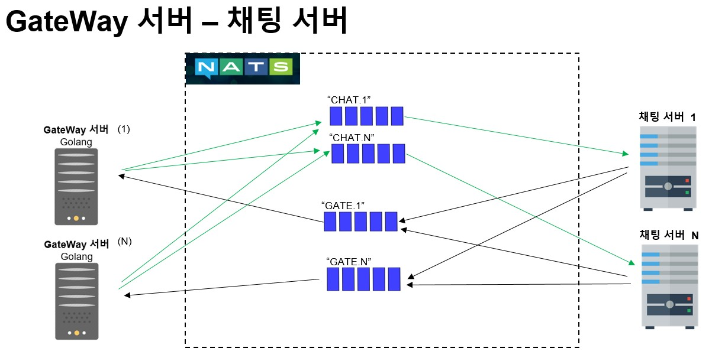

# NATs MQ를 이용한 채팅 시스템
  

## 목표
1. NATs MQ 사용 예를 보여주는 샘플 프로젝트
     
  
## 사용할 기술
1. NATs 
    - 핵심 기술, 서버간 통신에 사용한다
2. Golang
    - 게이트웨이(프론트) 서버
    - 클라이언트와 백엔드 서버 사이의 패킷을 중계한다.
3. C#
    - 채팅 Server, DB 서버에 사용한다
  
  
## 서버 구조
  
    
## 구현  
### GateWay Server
- Golang
- TCP Socket
- NATs MQ Client
  
  
### 채팅 Server
- C#
- .NET Core  
- NATs MQ Client
     
   
### DB Server
- C#
- .NET Core  
- MySQL Client
- CloudStructures
- NATs MQ Client
    
    
## 서버 to 서버의 MQ 통신 구조
  
 
DB 서버 연결 정책   
DB 서버는 MQ에 그룹으로 연결한다. 이렇게 하면 DB 서버를 스케일 아웃할 때 서버를 늘리면 큐에서 같은 그룹끼리는 분배해서 메시지를 가져간다.   
        
     
  
  
  
## 각 서버 별 큐의 이름
- DB 서버: DB
- GateWay 서버: GATE.서버번호
    - 예) GATE.1
- 채팅 서버: CHAT.서버번호
    - 예) CHAT.1