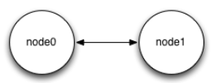
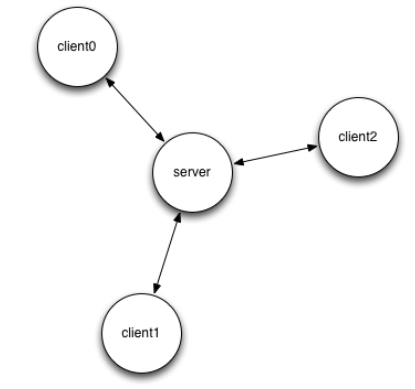
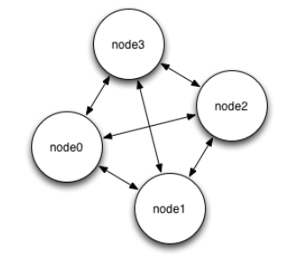

# Nanomsg
- ZeromMQ와 같은 경량 메시지 라이브러리
- [공식 사이트](https://nanomsg.org )
- [문서](https://nanomsg.org/documentation.html )
- [깃허브](https://github.com/nanomsg/nanomsg )
- 다양한 프로그래밍 언어의 바인딩 지원
    - 리스트 https://nanomsg.org/documentation.html
        
  
## 통신 패턴
- PAIR - 간단한 1 대 1 통신
- BUS - 간단한 다 대 다 통신
- REQREP - 사용자 요청을 처리하기 위해 Stateless 서비스의 클러스터를 구축 할 수 있다
- PUBSUB - distributes messages to large sets of interested subscribers
- PIPELINE - 여러 소스의 메시지를 집계하고, 여러 대상 간에 로드 밸런싱 한다
- SURVEY - 한 번에 여러 애플리케이션의 상태를 쿼리 할 수 ​​있다
  

## 프로토콜 
- INPROC - transport within a process (between threads, modules etc.)
- IPC - transport between processes on a single machine
- TCP - network transport via TCP
- WS - websockets over TCP    
  
  
## 패턴 
zeromq와 다른 부분만 정리하였다.  

### Pair (Two Way Radio)
  
  
- https://nanomsg.org/gettingstarted/pair.html
- 서로 1:1로만 연결
- 요청과 답변을 어느쪽에서든 할 수 있다.
    - req-rep에서는 한쪽만 요청을 할 수 있다.
  
### Survey (Everybody Votes)
  
  
- https://nanomsg.org/gettingstarted/survey.html
- 조사원 패턴은 시간 초과 설문 조사를 보내는데 사용되며, 응답은 설문 조사가 만료 될 때까지 개별적으로 반환된다. 이 패턴은 서비스 발견 및 투표 알고리즘에 유용하다.

### Bus (Routing)
  
  
- https://nanomsg.org/gettingstarted/bus.html
- 버스 프로토콜은 애플리케이션을 라우팅하거나 완전히 상호 연결된 메쉬 네트워크를 구축하는데 유용하다. 이 패턴에서 메시지는 직접 연결된 모든 피어에게 전송된다.

  
## ZeroMQ와 다른 것
[참고 문서](https://nanomsg.org/documentation-zeromq.html )  
  
- 라이센스: MIT 라이센스로 ZeroMQ 보다 더 자유롭다
- ZeroMQ는 BSD Socket API를 참조했지만 모든 API를 지원하지 않는다, nanomsg는 POSIX 호환을 목표로 하였다.
- C 언어로 만들었다. 그래서 더 최적화 되어 있고, 다른 언어 바인딩이 쉽다.
- ZeroMQ는 2008년 이후부터는 새로운 프로토콜이 추가 되지 않았지만 nanomsg는 추가 되었다.
    - SURVEY, BUS
- 스레딩 모델
    - ZeroMQ에서 사용한 큰 아키텍처 실수 중 하나는 스레딩 모델이다. 각각의 개체는 단일 스레드에 의해서만 관리된다. 작업자 스레드가 처리하는 비동기 객체에서는 잘 작동하지만 사용자 스레드가 관리하는 객체에서는 문제가 된다. 스레드는 임의의 시간 범위와 관련 없는 작업을 수행하는데 사용될 수 있다. 한 시간, 그리고 그 시간 동안 이것에 의해 관리 되는 객체는 완전히 붙어 있다. 불행한 결과로는 REQ/REP 프로토콜에서 요청 재전송을 구현할 수 없거나 응용 프로그램이 다른 작업을 수행하는 동안 PUB/SUB 구독이 적용되지 않는 것 등이 있다. nanomsg에서는, 객체가 특정 thread에 밀접하게 바인드 되어 있지 않기 때문에, 이러한 문제는 존재하지 않는다.
    - ZeroMQ의 REQ 소켓은 서비스 장애 등으로 인해 메시지가 손실 될 경우 막히게 되므로 실제 환경에서는 사용할 수 없다. 사용자는 대신 XREQ를 사용하고 스스로 재 시도하는 요청을 구현해야 한다. nanomsg를 사용하면 다시 시도 기능이 REQ 소켓에 내장되었다.
    - nanomsg에서는 REQ와 REP가 진행 중인 처리를 취소한다. REQ 소켓의 경우 응답을 기다리지 않고 새 요청을 보내거나 이전 요청에 응답하지 않고 새 요청을 가져 오기만 하면 된다 (REP 소켓의 경우).
    - ZeroMQ에서는 스레딩 모델로 인해 bind-first-then-connect-second 시나리오가 inproc 전송에 작동하지 않는다. nanomsg는 이 문제가 고쳐졌다.
    - 비슷한 이유로 자동 재 연결은 ZeroMQ에서 inproc 전송일 때는 작동하지 않는다. 이 문제는 nanomsg에서 수정 되었다.
    - nanomsg는 스레드로부터 안전하게 nanomsg 소켓을 만든다. 병렬로 여러 스레드에서 하나의 소켓을 사용하는 것은 여전히 ​​권장되지 않지만, 이런 상황에서 ZeroMQ 소켓이 무작위로 실패하는 방식은 고통스럽고 디버깅하기 어렵다.
- IOCP 지원
    - ZeroMQ의 오랜 문제점 중 하나는 Windows 2000 플랫폼 이상에서 BSD 소켓 API를 사용한다는 점이다. 대신에 IOCP를 사용하면 코드베이스를 대대적으로 다시 작성해야 하기 때문에 여러 번의 시도에도 불구하고 결코 구현 되지 않았다. IOCP는 더 나은 성능 특성을 지니고 있으며, 더 중요하게는 BSD 소켓 API를 통해 액세스 할 수 없는 NamedPipes와 같은 추가 전송 메커니즘을 사용할 수 있다. 이러한 이유로 nanomsg는 Windows 플랫폼에서 내부적으로 IOCP를 사용한다.
- 레벨 트리거 폴링
    - 사용자에게 혼란을 주는 ZeroMQ의 한 측면은 ZMQ_FD 파일 디스크립터를 사용하여 ZeroMQ 소켓을 외부 이벤트 루프에 통합하는 기능이었다. 혼란의 주요 원인은 디스크립터가 에지 트리거(edge-triggered)로  되었기 때문이다. 즉, 디스크립터는 이전에 메시지가 없고 새로운 메시지가 도착한 경우에만 신호를 보낸다. nanomsg는 과거에 사용 가능한지 여부에 관계 없이 사용 가능한 메시지가 있을 때 신호만 보내는 대신 레벨 트리거 파일 디스크립터를 사용한다.
- Zero-Copy
    - ZeroMQ는 "Zero-Copy" API를 제공하지만 실제로 Zero-Copy는 아니다. 그보다는 "메시지가 커널 경계에 도달 할 때까지만 Zero-Copy"이다. 이 시점부터 표준 TCP에서처럼 데이터가 복사된다. 반면에 nanomsg는 RDMA(CPU 바이패스, 직접 메모리 대 메모리 복사) 및 shmem(공유 메모리를 사용하여 동일한 상자에 있는 프로세스간에 데이터 전송)과 같은 진정한 Zero-Copy 메커니즘을 지원하는 것을 목표로 한다. zero-copy 메시징에 대한 API 진입 점은 send/recv 기능에 전달된 NN_MSG 옵션과 함께 nn_allocmsg 및 nn_freemsg 함수이다.
- 효율적인 구독 매칭
    - ZeroMQ에서는 간단한 시도로 PUB/SUB 구독을 저장하고 일치시키는 데 사용된다. 구독 메커니즘은 간단한 trie가 잘 작동하는 구독을 최대 10,000개까지 지원한다. 그러나 150,000,000 건의 가입을 사용하는 사용자가 있을 수 있다. 이러한 경우 보다 효율적인 데이터 구조가 필요하다. 따라서, nanomsg는 단순한 trie 대신에 Patricia trie의 메모리 효율적인 버전을 사용한다.
- 통합 버퍼 모델
    - ZeroMQ는 이상한 더블 버퍼링 동작을 한다. 송신 및 수신 데이터는 모두 메시지 대기열 및 TCP의 tx/rx 버퍼에 저장된다. 예를 들어 나가는 데이터의 양을 제한하려면 ZMQ_SNDBUF 및 ZMQ_SNDHWM 소켓 옵션을 설정해야한다. 의미적 차이가 없다는 점을 감안할 때, nanomsg는 TCP(또는 동등한) 버퍼만을 사용하여 데이터를 저장한다.
  
### Dissecting Message Queues  
2014년의 글  http://www.bravenewgeek.com/dissecting-message-queues/
  
- nanomsg는 ZeroMQ를 만들었던 멤버 중의 1명이 만든 라이브러리이다. 내가 이전에 설명했듯이, 양자의 동작은 매우 비슷했다. 개발의 관점에서 볼 때, nanomsg는 전반적으로 잘 알려지지 않은 API를 제공한다.  ZeroMQ와는 다르고, 소켓의 접속에 관한 개념이 없다. nanomsg가 접속 가능한 전송 프로토콜과 메시징 프로토콜을 제공해서 확장하기 쉽게 되어 있다. 추가 확장성 프로토콜도 아주 매력적이다.
- ZeroMQ 처럼 nanomsg에도 메시지가 atomic하게 손상 없이 전달되고, 순서가 붙는 것은 보증하지만, 전송 그 자체는 보증하지 않는다. 분할된 메시지는 전송 되지 않아서 그 중 모두 전송 되지 않은 메시지도 있다. nanomsg를 쓴 Martin Sustrik은 이것에 관해서 매우 명쾌하게 말했다.
> 전송 보증은 신화와 같은 것으로 100% 보장된 것이 없는 것이 우리들이 사는 세상이다. 대신에 우리가 해야할 것은 실패나 데미지를 받는 국면에서 회복력 있는 인터넷처럼 시스템을 구축하는 것이다.  
이 철학은 토폴리지 조합을 이용하여 최대한의 노력에 의해 이런 보증을 부가하는 회복력 있는 시스템을 구축하는 것이다.
- ZeroMQ는 2007년 쯤부터 많은 실험을 통해 승승장구했다 nanomsg의 전신이라고 보는 사람도 있지만 ZeroMQ에는 있지만 nanomsg에는 빠진 것이 있다. 이것은 활발한 개발자 커뮤니티와 풍부한 리소스와 교재이다. 많은 사람에 의해 고속 비동기 분산 메시징 시스템을 구축하면서 중요한 것은 이런 디펑트 툴이다.
- nanomsg와 같이 ZeroMQ는 메시지 지향 미들웨어가 아닌 단순히 소켓 추상으로서 동작한다. 유저빌리에서는 API가 조금 헷갈리지만 nanomsg와 비슷하다.  
  

# NNG - nanomsg-NG (nanomsg™ next generation)
- nanomsg의 차기 버전이다.
- 현재(2019.06.19) 1.1.1 버전
- 2.0 버전에서는 nanomsg를 대체할 계획을 가지고 있다
    - 그래서 2.0에서 이름이 nanomsg2로 될 수도 있고, 지금처럼 nng로 있을 수 있다.  
  
- [공식 사이트](https://nanomsg.github.io/nng/ )
- [NNG Reference Manual](https://nanomsg.github.io/nng/man/v1.1.0/index.html )
- [NNG Reference Manual: tip](https://nanomsg.github.io/nng/man/tip/index.html )
- [무료 책](https://leanpub.com/nngmanual )
- [깃허브](https://github.com/nanomsg/nng )
- [Rationale: Or why am I bothering to rewrite nanomsg?](https://nanomsg.github.io/nng/RATIONALE.html )
- [빌드 및 간단 설명](https://mbxx.tistory.com/68)
