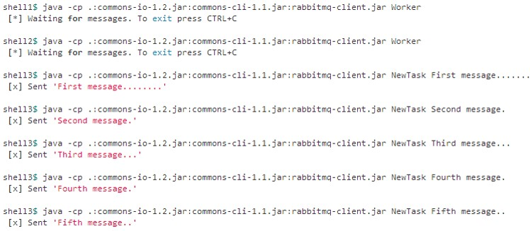
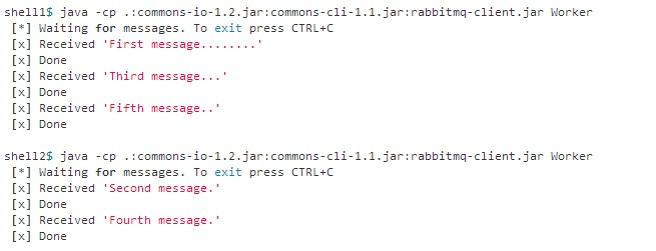

# RabbitMQ - C#
- 라이브러리 리스트: https://www.rabbitmq.com/devtools.html
  


## 튜토리얼
http://www.rabbitmq.com/tutorials/tutorial-one-dotnet.html    
    
### 지정한 Queue에서 Message를 송수신하는 아주 간단한 프로그램
    
  
Send  
```
using System;
using RabbitMQ.Client;
using System.Text;

class Send
{
    public static void Main()
    {
        // 연결주소
        var factory = new ConnectionFactory() { HostName = "localhost" };
        using(var connection = factory.CreateConnection())
        using(var channel = connection.CreateModel())
        {
            // Hello 라는 큐 선언
            channel.QueueDeclare(queue: "hello",
                                 durable: false,
                                 exclusive: false,
                                 autoDelete: false,
                                 arguments: null);

            string message = "Hello World!";
            var body = Encoding.UTF8.GetBytes(message);

            channel.BasicPublish(exchange: "",
                                 routingKey: "hello",
                                 basicProperties: null,
                                 body: body);
            Console.WriteLine(" [x] Sent {0}", message);
        }

        Console.WriteLine(" Press [enter] to exit.");
        Console.ReadLine();
    }
}
```
  
Receive  
```
using RabbitMQ.Client;
using RabbitMQ.Client.Events;
using System;
using System.Text;

class Receive
{
    public static void Main()
    {
        var factory = new ConnectionFactory() { HostName = "localhost" };
        using(var connection = factory.CreateConnection())
        using(var channel = connection.CreateModel())
        {
            channel.QueueDeclare(queue: "hello",
                                 durable: false,
                                 exclusive: false,
                                 autoDelete: false,
                                 arguments: null);

            // EventingBasicConsumer는 비동기로 동작한다
            var consumer = new EventingBasicConsumer(channel);

            // 큐에서 메시지를 가져오면 호출한다
            consumer.Received += (model, ea) =>
            {
                var body = ea.Body;
                var message = Encoding.UTF8.GetString(body);
                Console.WriteLine(" [x] Received {0}", message);
            };

            channel.BasicConsume(queue: "hello",
                                 autoAck: true,
                                 consumer: consumer);

            Console.WriteLine(" Press [enter] to exit.");
            Console.ReadLine();
        }
    }
}
```  
  
#### API: QueueDeclare  
```
QueueDeclare(string queue, bool durable, bool exclusive, bool autoDelete, IDictionary<string,object> arguments)
```  
Queue를 만드는 것을 declare라고 하고, 애플리케이션 코드에서도 쉽게 만들 수 있다.   
만약 해당 큐가 이미 존재하고 있다면, 다시 queue를 만들지 않고, queue가 없을 경우에만 만든다.   
- durable 속성: 메세지를 디스크에 저장. memory에 저장하는 것은 transient라고 한다.  
- auto-delete : 모든 consumer가 unsubscribe하면, 해당 queue는 자동으로 없어진다.  
- exclusive 옵션을 true로 하면 다른 Client는 이용할 수 없는 Queue를 만든다. 또 exclusive 옵션을 사용한 Queue는 Client가 Rabbit MQ에서 끊어진 시점에서 자동으로 삭제된다.
  
#### API: BasicPublish
immediate를 지원하지 않는다. 배송지의 Consumer가 존재하지 않는 경우 Queue에 저장하지 않는다.  
exchange가 ""(널 문자)이면 direct 방식.  
  


### Roundobin Dispatching・Message Acknowledgment・Message durability・Fair Dispatching  
    
    
Producer로 동작하는 NewTask와 Consumer로 동작하는 Worker 2가지.  
  
NewTask는 Task를 생성하고 Message에 캡슐화하여 Work Queue(실제로는 앞의 Queue와 다르지 않지만 다른 것과 구별하기 위해서 Work Queue라고 기술한다) 에 보낸다.   
  
Work Queue는 수신한 Message를 바로 Worker에 할당하고, 할당된 Message에 대해서 Woker가 하는 처리의 완료를 기다리지 않는다.  
다수의 Worker는 할당된 Message를 뒤에서 처리하도록 스케쥴링(내부 Queue에 저장) 를 하지 않고 Message를 언 캡슐화 하여 Task를 처리한다.  
  
#### Roundrobin Dispatching
Work Queue를 사용하는 이점 중 하나는 Worker를 쉽게 병렬화 할 수 있다.   
두 개의 Worker를 동시에 구동하고 어떻게 Work Queue에서 Message를 수신할지 확인한다.   
두 개의 Worker를 기동한 상태에서 NewTask으로 처리 시간이 다른 여러 Task를 Message에서 캡슐화하고 Work Queue에 보낸다.  
  
기본 설정으로 RabbitMQ는 다음 Cosumer에 순서대로 Message을 보낸다.  
어떤 Message라도 관계 없이 전체의 평균은 각 Consumer는 같은 수의 Message를 가져온다. 이 Message 분산 방식을 라운드 로빈이라고 부른다.  
Worker를 3개 이상 동시에 구동하는 경우도 시도해 보자. 만약에 한쪽 Woker에 처리 시간이 큰 Message만 할당된 경우에 관해서는 후술하는 Fair Dispatching에서 소개하고 있다.  
    
#### Message Acknowledgment
Task에 처리에 몇초를 필요로 하는 경우가 있다. 다수의 Worker중 1대가 Task를 실행 중에 죽었을 경우 어떠한 행동을 할까?  
  
현재의 Worker 샘플 코드에서는 Worker에 Message를 할당과 동시에 Work Queue(구체적으로는 메모리)에서 Message를 삭제한다. 그래서 만약 Worker를 강적적으로 종료했을 경우 처리를 수행하던 Message를 잃는다. 또 Worker의 내부 Queue에 저장되어 있었던 "아직 처리되지 않은 Message"도 모두 잃는다.  
  
그러나 어떤 Message도 잃지 않고 싶은 경우가 있다. 만약 Worker가 Message을 처리하는 중에 종료했을 경우 다른 Worker에 Message을 배정하기 바란다.  
  
Message를 잃지 않는 구조로서 RabbitMQ는 Message Acknowledgment(ACK)에 대응하고 있다. Consumer는 RabbitMQ에서 Message를 수신한 타이밍이나, Message에 대한 처리가 완료된 타이밍에서 ACK를 반송한다. RabbitMQ는 Consumer에서 ACK를 받으면 Queue에서 Message를 삭제한다.  
  
ACK가 전달되지 않고 Consumer가 종료했을 경우는 RabbitMQ는 완전히 처리되지 않은 Message을 다른 Consumer에 할당한다. 만약 Consumer가 크래시(또는 의도적으로 강제 종료) 해도 Message를 잃지 않는 것을 확인할 수 있다.  
  
RabbitMQ에서는 ACK의 타임 아웃은 없다. Consumer와의 연결이 끊어졌을 때만 다른 Consumer에 Message 할당을 실시한다. 처리 시간이 아주 긴 Message라도(ACK가 도착할 때까지 특별한 처리는 하지 않으므로)문제 없다.  

앞 및 현재의 샘플 코드에서는 Channel.BasicConsume(queue, autoAck, callback)에서 명시적으로 autoAck플래그를 true로 하고 있었다. 그래서 Worker는 Message를 Work Queue에서 할당된 시점에서 ACK을 자동적으로 반송하였다. 이 autoAck 플래그를 false로 할 경우에는(대부분의 경우는 Task의 처리가 끝난 시점에서) ACK를 수동으로 돌려보내야 한다.  
  
```
channel.BasicConsume(queue: "hello",
                            autoAck: true,
                            consumer: consumer);
```  
이렇게 하면 만약 Message를 처리하고 있는 Worker를 CTRL+C로 강제 종료한다고 해도 어떤 Message를 잃지 않는다.   
그리고 바로 ACK가 돌아오지 않은 Message를 다른 Worker에 할당한다.  
  
Channel.BasicAck()을 잊는 것은 흔한 실수지만 중대한 영향을 미친다. 아까도 했지만 ACK가 되 돌아오고 있지 않는 Message는 Worker와 연결이 끊어진 시점에서 다시 할당된다. 그래서 ACK가 돌아오지 않은 Message는 삭제되지 않아서 Work Queue의 사용 메모리가 비대화 한다.  
이 실수를 알기 위해서는 RabbitMQ의 "rabbitmqctl"명령에서 "message_unacknowledged"필드를 확인해라.  
  
#### Message durability
복수의 Worker에서 라운드 로빈을 사용하는 경우에 한 Worker가 갑자기 종료하더라도 다른 Worker에서 Message를 처리하는 방법을 소개했다.  
  
그러나 지금의 상태라면 RabbitMQ 자체가 크래시 되는 경우는 RabbitMQ에서 선언된 Queue 및 Queue에 저장되어 있는 Message가 없어진다. 방금 전과 마찬가지로 Queue및 Message도 잃고 싶지 않은 경우도 있을 것이다.   
  
물론 RabbitMQ에서는 Queue및 Message에 영속제를 가질 수 있다.  
그러기 위해서는 다음처럼 영속성 플래그를 Queue 선언 시 유효하게 할 필요가 있다.  
```
channel.QueueDeclare(queue: "hello",
                        durable: true,
                        exclusive: false,
                        autoDelete: false,
                        arguments: null);
```
  
이 명령 자체는 옳지만 이번 NewTask에서는 동작하지 않는다. 왜냐하면 이미 영속성을 갖지 않는 "hello"라는 이름을 가진 Queue를 선언하고 있기 때문이다.   
  
RabbitMQ에서는 존재하는 Queue에 대해 다른 파라미터로 재정의하는 것은 인정하지 않고, 만약 다시 정의한 경우는 에러를 반환한다. 
회피책으로서 다음과 같이 다른 이름(이번 경우는 task_queue)Queue를 정의한다.  
```
channel.QueueDeclare(queue: "task_queue",
                        durable: true,
                        exclusive: false,
                        autoDelete: false,
                        arguments: null);
```  
  
이 Channel.QueueDeclare()의 수정은 NewTask와 Worker의 양쪽 모두에 적용할 필요가 있다.
여기에서 중요한 점은 만약 RabbitMQ를 재시작해도 "task_queue"라는 이름을 가진 Queue가 상실되지 않음을 보증하는 것이다.  
  
다음으로 RabbitMQ가 Message를 잃지 않는 방법을 소개한다.  
Message에 영속성을 가지려면 BasicProperties를 구현한 IBasicProperties.SetPersistent을 다음과 같이 설정한다.  
```
var properties = channel.CreateBasicProperties();
properties.SetPersistent(true);
```
  
Message에 영속성을 부여한 경우라도 Message를 잃지 않는 것을 반드시 보증하는 것은 아니다.  
영속성을 지속함과 Message을 보존하도록 하지만 Message를 받은 때에 저장 되지 않는 약간의  시간이 있다. 또한 RabbitMQ는 각각의 Message에 대해 fsync(2)을 실시하지 않는다.   
즉, Message는 보통 디스크에 저장되지만 메모리 캐시에 저장될수도 있다.  
Message의 영속성 보장은 확실하진 않지만 사용법에 따르면 충분한 경우도 있다. 만약 확실한 영속성을 요구하는 것이라면 Message의 송신을 트랜잭션 처리에서 랩 해야한다.  
  
#### Fair Dispatch
라운드 로빈이라고 하지만 만약 한쪽 Woker에 처리 시간이 긴 Message만이 할당된 경우는 어떠한 행동을 할까? 우선은 실제로 시험해 보자.  
  
두 개의 Worker를 동시에 구동하고 어떻게 Work Queue에서 Message를 수신하는지 확인한다.   
두 개의 Worker를 기동한 상태에서 NewTask에서 기수 몇 차례의 경우에 처리 시간이 긴 Message를 Work Queue에 보낸다.  
  
  
  
각각의 Worker는 다음과 같이 Message를 수신하고 있습니다.    
  
  
해결하려면 Channel.BasicQos(prefetchCount)를 설정한다.  
이로써 RabbitMQ는 prefetchCount를 넘는 Message를 Consumer에 전달할 수 없게 된다.   prefetchCount에 1을 설정한 경우는 Consumer가 뭔가 처리를 하고 있는 동안에는 새로운 Message의 할당을 하지 않는다. 대신 아무것도 처리를 하지 않고 있는 다음 Consumer에 Message를 할당한다.  
```
channel.BasicQos(0, 1, false);
```
  
앞과 같은 상태를 재현해 본다.  
두 개의 Worker를 동시에 구동한다, 어떻게 Work Queue에서 Message를 수신하는지 확인한다.   
두 개의 Worker를 기동한 상태에서 NewTask에서 기수 몇 차례의 경우에 처리 시간이 긴 Message를 Work Queue에 보낸다.  
  
    

### Publish/Subscribe
X(FanOut)에 의해 여러 큐에 동일한 메시지를 보낸다. 따라서 C1, C2가 동일한 메시지를 받지만 하는 일은 서로 다른다. 이는 데몬©의 개수가 증가함에 따라서 병렬 처리가 되어 처리 속도가 향상 될 수 있다.  
```
channel.ExchangeDeclare("logs", "fanout");
```
  
 
  
  
### Routing
https://www.rabbitmq.com/tutorials/tutorial-four-dotnet.html    
  
C가 X(direct)와 큐를 바인딩 할 때 Key를 명시하고, 메시지의 Key와 비교해서 동일한 경우에만 각 큐에 삽입된다.  
그림에서 Key가 orange일 때는 Q1에 삽입되고, black이나 green일 때는 C2에만 삽입된다. 그 외의 Key는 큐에 삽입되지 않는다. 즉 그외의 Key를 가진 메시지는 버려진다.  
  
    
  
### Topics
https://www.rabbitmq.com/tutorials/tutorial-five-dotnet.html  
  
앞의 Routing 예제와 비슷하다. 단 Key를 비교할 때 complete matching이 아니라 pattern matching를 사용한다. 이 때 key는 .(마침표)로 구분되어 word(토큰)로 나누어지며, 각 word에 대하여 *는 1 단어를, #은 0 또는 여러 개의 단어를 의미한다.
  
  
   
  

  
## 참고  
- .NET/C# Client API Guide  https://www.rabbitmq.com/dotnet-api-guide.html  
- Learn RabbitMQ With C#  https://www.slideshare.net/imdurgesh/learn-rabbitmq-with-c


