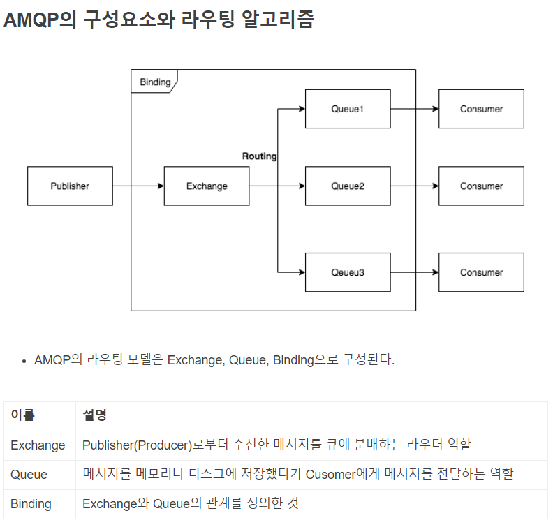
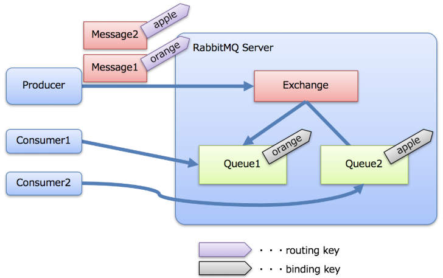
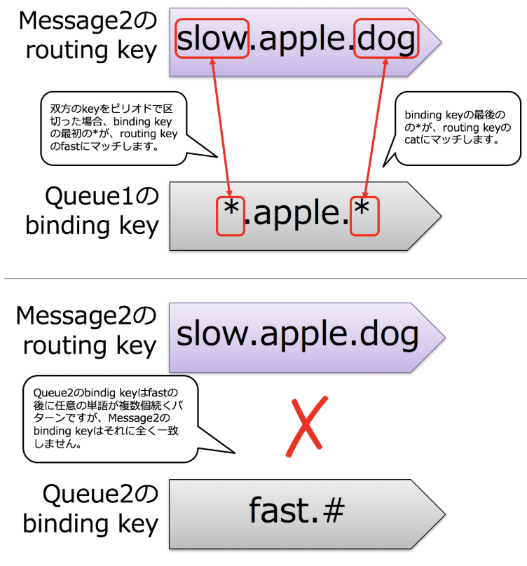

# RabbitMQ
- [공식 사이트](https://www.rabbitmq.com/ )
- ActiveMQ 보다 빠르고, ZeroMQ 에 없는 영속성을 가지고 있으며, 확장하기 쉬운 큐 이다.
- 얼랭으로 만듬
- 공식 사이트에 문서가 풍부하다
- 커뮤니티가 활발하다
- 오픈 소스
- 크로스 플랫폼 지원
- 다양한 클라잉너트 라이브러리
- 유연한 성능과 안정성 절충 제어 
    - 안정적인 메시지 전달과 메시지 처리량 혹은 성능을 유연하게 재어할 수 있는 옵션을 제공한다. 메시지를 배달하기 전에 디스크에 저장할 수 있고, 클러스터를 설정할ㅇ 때 큐를 HA로 설정해서 여러 노드에 걸쳐 저장하므로 일부 서버 장애로 메시지가 손실되지 않는다.
- 서드파티 플러그인
- 보안 계층  
    

[임시 ppt 만들 때 사용. RabbitMQ 좋은 것과 조심할 것](https://www.slideshare.net/techblogyahoo/rabbit-mq-jjug )    
장점 32p 느슨한 아키텍처

## 사용하는 곳
- [티몬](https://tmondev.blog.me/221051503100 )
- Reddit
- NASA
- 아구라 게임즈(Agoura Games)
- 블리자드. [글로벌 게임 플랫폼에서 무정지, 무점검 서버 개발과 운영 사례](https://www.slideshare.net/ifkakao/ss-113145623)
- 구글의 Admob  


## AMQP
AMQP와는 Advanced Message Queuing Protocol의 약칭으로 비즈니스 메시지를 애플리케이션이나 조직 사이에서 전달하기 위한 공개 표준이다.  
공식 사이트에 의하면 원래는 금용 기관용으로 개발된 것으로 뱅크오브아메리카, JPMorgan, 독일 은행 등 미국 유럽의 유력 은행에서 이용 되었다.   
주요 기능으로는 서로 다른 조직, 서로 다른 플랫폼, 서로 다른 시간(비동기화 처리) · 다른 위치(분리된 장소 또는 네트워크 환경)에서도 연결할 수 있다는 것이 강점이다.  
  
출처: https://cheese10yun.github.io/spring-rabbitmq/#rabbitmq-amqp    
 
  
  
    
 
  

## 메시징 미들웨어가 필요한 이유
- 비동기
- 확장성
- 장해 내구성
  

## 비동기 처리
이전의 비동기 처리  
  
  
최근의 비동기 처리  
   
  
  
## Rabbit MQ
출처: https://cheese10yun.github.io/spring-rabbitmq/#rabbit-mq-2  
RabbitMQ는 AMQP를 구현한 오픈소스 메시지 소프트웨어 Pulisher(Producer)로부터 메시지를 받아 Cunsumer에게 라우트하는 것이 주된 역할이다.  
  
  
  
아키텍처 설계/구현을 위한 기본 구조  
 
  

### 용어
- Producer
    - 큐를 던지는 사람이다. 웹에서 예를 들면 웹 애플리케이션이다.
- Consumer
    - 큐룰 받는 사람이다. 웹에서 예를 들면 워크 프로세스에 해당한다.
- Message
    - 메시지이다 .Producer 또는 Consumer의 사이에서 주고 받는 본문이다.
- Queue
    - 메시지를 넣는 것이다. 이 넣는 것에 Consumer가 접속해서 Queue 중에 있는 Message를 가져간다.
- Exchange
    - 이것은 RabbitMQ (AMQP?) 특유의 생각으로 Producer가 Message를 RabbitMQ 서버에 투입하면, 먼저 Exchange가 받고, Message에 첨부된 라우팅 키와 Queue에 첨부된 바인딩 키를 참조하여 적절한 Queue에 배송한다. RabbitMQ에서는 Producer는 Queue에 Message를 배송하는 것이 아닌 Exchange에 배송한다. 이미지는 아래 그림처럼이다. 
    
   
Queue1에는 orange, Queue2에는 apple라는 binding key가 부여 되고 있다.  
1. Producer는 각각 orange, apple 이라는 routing key가 부여된 Message를 RabbitMQ Server에 던진다.
2. Exchange는 큐를 받고, Message에 부여된 routing key, Queue에 부여된 binding key를 보고 routing key에 일치하는 binding key가 부여된 Queue에 Message를 배송한다.즉, Message1은 Queue1에 Message2는 Queue2에 배송된다.
3. Consumer1 및 Consumer2는 각각 Queue1 및 Queue2에서 Message1, Message2를 받는다.
    
### Exchange의 종류
Exchange의 종류(Queue로의 배송 규칙)에는 몇 가지가 있다.  
  
- direct
    - routing key와 binding key가 일치한 Message만 Queue로 배송한다.조금 전, 그림에 나타낸 것이, 확실하게 direct가 된다.
- fanout
    - binding key를 무시하고 모든 Queue에 Message를 배송한다. 바로 브로드캐스트 이다.
- topic
    - routing key와 binding key를 비교할 때 부분일치를 허용한다. SQL의 like문 같은 것이다. like문은 % 밖에 못 쓰지만 RabbitMQ는 2개의 특수 문자를 사용할 수 있다.

     
Queue1의 binding key：*.apple.*  
Queue2의 binding key：fast.#  
  
*: 1개의 단어를 치환  
#: 0개 이상의 단어를 치환  
  
■ Message1의 경우  
Message1은 Queue1과 Queue2 양쪽에 도착한다. 이유는 아래 그림.  
      
   
■ Message2의 경우  
Message2는 Queue1에만 도착한다. 이유는 아래 그림.    
      
  
    
  
## 설치
### Windows
- 최신 버전의 RabbitMQ를 다운로드 한다. 
    - https://www.rabbitmq.com/download.html
- 위에서 다운로드 받은 RabbitMQ와 호환되는 얼랭/OTP를 다운로드 한다.
    - RabbitMQ 3.7.16 버전은 얼랭/OTP 22 버전과 호환
    - http://www.erlang.org/downloads
- 얼랭/OTP를 관리자 권한으로 먼저 설치한다
- RabbitMQ를 설치한다
- 설치가 끝나면 서비스에서 자동으로 실행된다
    
#### setting
  
```  
cd ${RABBIT_MQ_INSTALLED_DIRECTORY}/sbin
rabbitmq-plugins.bat enable rabbitmq_shovel
rabbitmq-plugins.bat enable rabbitmq_management
rabbitmq-plugins.bat enable rabbitmq_shovel_management
```  
    
#### 참고
[Windows에 설치하기](https://its21c.net/250 )  


### CentOS
epel 저장소를 설치한다.
```
# rpm -Uvh http://download.fedoraproject.org/pub/epel/7/x86_64/Packages/e/epel-release-7-11.noarch.rpm
```  
  
RabbitMQ를 만든 언어 erlang을 설치한다.  
```
# yum install erlang
```  
  
RabbitMQ을 설치한다.  
```
# yum install rabbitmq-server
```  
  
RabbitMQ를 시작한다.  
```
# systemctl start rabbitmq-server
```  
  
RabbitMQ의 관리 화면에 접속하기 위해 플러그인을 유효하게 한다.   
```
# rabbitmq-plugins enable rabbitmq_management
```  
  
#### 참고
[CentOS 6.8에서 RabbitMQ 설치하기](https://hsunryou.blog.me/221162051242 )  
   
  
### CentOS 7

```
yum install epel-release -y
yum update -y
yum install erlang -y
yum info erlang
rpm --import https://www.rabbitmq.com/rabbitmq-release-signing-key.asc
yum install wget -y
wget https://dl.bintray.com/rabbitmq/all/rabbitmq-server/3.6.14/rabbitmq-server-3.6.14-1.el7.noarch.rpm
yum install rabbitmq-server-3.6.14-1.el7.noarch.rpm -y
systemctl enable rabbitmq-server.service
systemctl start rabbitmq-server
systemctl status rabbitmq-server
rabbitmq-plugins enable rabbitmq_management
firewall-cmd  --permanent --add-port=15672/tcp
firewall-cmd --reload
rabbitmqctl add_user admin 임의의 패스워드
rabbitmqctl set_user_tags admin administrator
rabbitmqctl set_permissions -p / admin ".*" ".*" ".*"
http://xxx.xxx.xxx.xxx:15672/  admin으로 로그인 가능하면 성공
```
        
#### 참고
[CentOS 7 RabbitMQ 설치 방법](https://blog.naver.com/yesql/221442367845 )    


### brew로 설치
linux, OSX 에서 사용할 수 있다.  
  
```  
brew install rabbitmq
```      
  
   
### Ubuntu
[우분투에서 RabbitMQ 설치하기](https://blog.naver.com/heejoo29/221088856630 )  
  


## 설정
- http://www.rabbitmq.com/configure.html
- 설정 파일 혹은 시스템 변수를 사용한다 
  

## 명령어 리스트
### rabbitmqctl
#### rabbitmq의 환경 설정을 확인
```
[selmertsx@rabbitmq]$ rabbitmqctl environment
Application environment of node rabbit@localhost ...
[{auth_backends,[rabbit_auth_backend_internal]},
```  
  
#### rabbitmq의 실행 상태를 확인
```
[selmertsx@rabbitmq]$ rabbitmqctl status
Status of node rabbit@localhost ...
[{pid,16570},
 {running_applications,
     [{rabbitmq_management,"RabbitMQ Management Console","3.3.4"},
      {rabbitmq_web_dispatch,"RabbitMQ Web Dispatcher","3.3.4"},
      {webmachine,"webmachine","1.10.3-rmq3.3.4-gite9359c7"},
```        
  
#### list_queues queue의 message 상태 보기
```
[selmertsx@color-server]$ rabbitmqctl list_queues name messages_ready messages_unacknowledged
Listing queues ...
amq.gen-2oo35vOvojjfIvoNXQLHSw  0   0
amq.gen-Lx64bchkvkTI6qrtzSxPHw  0   0
amq.gen-PU03OHSwGzxTwIBFKSkq2A  0   0
amq.gen-h73HZznBoHBdA_Gug40QTA  1   0
```   
  
#### 모든 큐를 제거하기
```
rabbitmqctl stop_app

rabbitmqctl reset

rabbitmqctl start_app
```
  
`rabbitmqctl list_queues` 명령으로 큐 목록을 확인하면 비어 있음을 확인할 수 있다.     
  
#### 바이딩 목록 보기
```
rabbitmqctl list_bindings
```
    
  
### rabbitmq-server
#### RabbitMQ의 브로커 실행하기
```
[selmertsx@~]$ rabbitmq-server

              RabbitMQ 3.3.4. Copyright (C) 2007-2014 GoPivotal, Inc.
  ##  ##      Licensed under the MPL.  See http://www.rabbitmq.com/
  ##  ##
  ##########  Logs: /usr/local/var/log/rabbitmq/rabbit@localhost.log
  ######  ##        /usr/local/var/log/rabbitmq/rabbit@localhost-sasl.log
  ##########
              Starting broker... completed with 10 plugins.
```  
  
### rabbitmq-plugins  
#### 이용하는 plugin 리스트 확인
```
[selmertsx@~]$ rabbitmq-plugins list -e
[e] amqp_client                3.3.4
[e] mochiweb                   2.7.0-rmq3.3.4-git680dba8
[E] rabbitmq_amqp1_0           3.3.4
[E] rabbitmq_auth_backend_http 3.3.4
[E] rabbitmq_management        3.3.4
[e] rabbitmq_management_agent  3.3.4
[E] rabbitmq_mqtt              3.3.4
[e] rabbitmq_web_dispatch      3.3.4
[e] webmachine                 1.10.3-rmq3.3.4-gite9359c7
```
  
  
## 계정
- http://www.rabbitmq.com/access-control.html
- 기본으로 'guest' 계정을 사용할 수 있다(암호도 guest)
    - guest는 localhost 접속에서만 사용 할 수 있다
- 설정 파일에 계정을 등록
- 커맨드라인으로 계정 등록
    - rabbitmqctl add_user "계정" "패스워드"
- 퍼미션(권한) 부여(커맨드라인으로)
    - rabbitmqctl set_permissions -p / testuser ".*" ".*" ".*"
    - 퍼미션은 정규표현으로 지정. 퍼미션 대상은 Configure, Write, Read.
- 관리자 권한 주기
    - rabbitmqctl set_user_tags tonyg administrator
- 퍼미션 확인
    - rabbitmqctl list_permissions
- 웹기반 관리 툴에서 관리할 수 있다.
  
  
## 가상호스트
- http://www.rabbitmq.com/access-control.html
- 계정만으로 접속 불가. 가상호스트와 연결지어줘야 한다.기본으로는 '/' 라는 가상호스트만 있다.
- 가상호스트와 계정 연결하기. 
    - 예) scott는 / 가상호스트에 연결하기
    - rabbitmqctl map_user_vhost scott /
- 특정 유저가 연결된 모든 가상호스트 보기 
    - 예) rabbitmqctl list_user_vhosts scott
- 특정 가상호스트와 연결된 모든 유저 보기 
    - 예) rabbitmqctl list_vhost_users /
  
  
## Web 기반으로 관리/감시
- 플러그인을 사용한다.
- rabbitmq-plugins enable rabbitmq_management
- Rabbitmq를 재 시작해야 적용된다.
- http://localhost:15672/ 
- 접속하면 르고으니 화면이 나온다
- 기본으로는 guest/guest 로 접속할 수 있다.
  
   
    
    
## 튜토리얼 
- [공식 사이트의 튜토리얼](https://www.rabbitmq.com/getstarted.html )  
    - [일본어 번역. Node.js](https://kuroeveryday.blogspot.com/2017/02/rabbitmq-tutorial1-nodejs.html )
    
   
## 1Node의 Queue의 전체 한계치
- 기본으로는 실제 메모리의 40%.
- 메모리 사이즈를 얻을 수 없을 때는 1G로 한다.
- 상한을 넘으면 Channel.Flow에서 정지를 보고한다. 그 후 다시 떨어지면 Channel.Flow에서 개시를 알려준다.
- rabbitmq.config에서 상한치를 변경 할 수 있다.  
   [{rabbit, [(vm_memory_high_watermak, O. 8 )])]  
- Queue 마다의 메모리 소비량 확인
  
    
     
[메모리 관련 설정 및 설명](https://blog.naver.com/parkjy76/220826990472 )   


## 프로그래밍
메시지 p47 ~ 53  
메시지 발행 p57  
메시지 소비하기 p58  
메시지 속성 (페이지 68~89)
발행 속도와 배당 보장의 균형 P92  
라우팅 할 수 없는 메시지를 위한 대체 익스체인지 사용 p102  
HA 큐  p108
소비자 성능 조정 p 126  
큐 제어하기 p 138  

  


## 참고
- Dead Letter 채널 패턴
    - 전송된 메시지가 정상으로 처리되지  않은 경우에 처리할 수 없었던 메시지를 전용의 Exchange로 보내는 패턴, RabbitMQ 에는 이것을 구현하기 위한 기능이 들어가 있다.
    - [RabbitMQ - Dead Letter Exchanges](https://www.rabbitmq.com/dlx.html)
- [RabbitMQ Simulator](http://tryrabbitmq.com/ )
    - 웹에서 RabbitMQ 구조를 작성한 후 어떻게 동작하는지 시뮬레이트 할 수 있다
  
- 성능측면에서 kafka가 더 좋다고 한다([출처](https://blog.naver.com/forioso/221236895396 )). 단 kafka는 단순한 기능만 제공한다.
    - [kafka 소개](https://blog.naver.com/jogakdal/221089958743 )
- [Delayed Message](https://blog.naver.com/ssm026n/220993111028 )  


