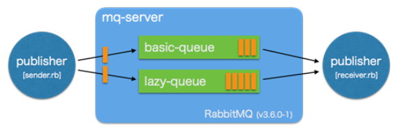

# Lazy Queues
출처: https://codezine.jp/article/detail/9288  

RabbitMQ에서는 받은 메시지를 인 메모리 데이터베이스에 저장한다.  
물론 메모리에만 저장 되어 있는 경우에는 해당 노드에서 장애가 발생했을 때 메시지를 잃어버리기 때문에 큐에 메시지를 영속화하도록 설정할 수 있다.  
또, 메모리 용량에 부족할 때는 RabbitMQ는 메시지를 스토리지로 옮기는 처리(페이지 아웃 처리)를 실행한다. 페이지 아웃 처리 중에는 큐를 차단하기 때문에 이동안 RabbitMQ는 메시지를 받을 수 없다.  
이 때문에 Kafka에서 할 수 있는 오프라인 시스템에서의 이용 등 대용량의 데이터가 큐에 체류하는 활용 사례에서의 이용에 큰 제한이 있었다.  
  
이 문제를 해결하는 시스템으로 2015년 12월에 발매된 RabbitMQ v3.6.0에 "Lazy Queues" 기능이 추가 되었다.  
Lazy Queues가 설정된 큐에서는 Kafka와 마찬가지로 큐에 도착한 메시지는 모두 파일에 쓴다.  
이로 인해 큐에 의해서 소비되는 메모리 용량이 극적으로 줄면서 대용량의 데이터가 큐에 체류하는 활용 사례도 대응할 수 있게 되었다.  
     

## 어떻게 사용하나?
실제로 Lazy Queues를 설정한 큐를 정의해 주고, 큐에 대해서 메시지를 보내는 처리를 기술해 본다.  
  
우선은 Lazy Queues를 사용하지 않는, 통상의 큐를 이용해 아래의 단순한 Pub-Sub 모델의 시스템을 기술한다.구현에 있어서 Ruby(v2.2.2)와 Ruby판 RabbitMQ 라이브러리 Bunny를 사용한다.  
  

  
## 보통의 큐
우선 처음에, 메시지의 송신 처리를 기술한다. 아래의 코드는 RabbitMQ서버 "mq-server"에 대해서, 1KB의 메시지 보내는 처리이다.  
```
require 'bunny'

c = Bunny.new(:host => 'mq-server', :user => 'tsuchinoko', :password => 'passwd')
c.start

ch = c.create_channel
q = ch.queue('basic-queue')

begin
  loop do
    q.publish('a' * 1024)
  end
rescue Exception => _
  ch.close
  c.close
end
```
  
코드의 내용을 쉽게 풀이하면 3행에서 설정한 RabbitMQ 서버의 정보를 바탕으로 4행에서 연결을 확립한다.  다음으로 6행에서 Channel로 불리는 객체를 생성한다.  
Channel은 AMQP에서 규정된 메시지 브로커 내부에서의 논리적 접속으로, 하나의 TCP connel을 정의할 수 있다. 또 큐, 익스체인지의 설정·상태는 Channel 마다 독립적이다. 그러므로 Channel에 대한 조작은 스레드 세이프하고, 안전하게 병렬처리를 할 수 있다.  
그리고 7행에서 "basic-queue"라고 이름화한 큐를 생성하고 있다.  
10-12행에서 이 큐에 대해서 사이즈 1KB의 메시지를 계속 보낸다.
  
계속해서, 수신 처리를 기술한다.  
```
require 'bunny'

c = Bunny.new(:host => 'mq-server', :user => 'tsuchinoko', :password => 'passwd')
c.start

ch = c.create_channel
q = ch.queue('default-queue')

begin
  q.subscribe(:block => true) do |delivery_info, properties, data|
    puts data
  end
rescue Exception => _
  ch.close
  c.close
end
```
      
7행까지는 메시지 송신 처리와 같다. 메시지의 수신은 10행의 subscribe에서 열린다.  
서버의 큐 "basic-que"에 메세지가 존재하면, 블록 내부의 처리를 부를 수 있다.  
블록에서 받는 3개의 파라미터는 각각 다음과 같다.  
- delivery_info : 어떤 애플리케이션에서 어떤 경로로 보내졌는가 라는 메시지 전송 처리에 관한 정보
- properties:데이터 타입이나 영속화 되어 있는가, 라는 메시지 자체의 메타 데이터 정보
- data : 큐에 저장된 메시지의 본체
  
  
## Lazy Queues를 설정한 큐
그러면, 다음으로 Lazy Queues를 이용한 송신 처리를 기술한다.  
Lazy Queues는, 큐를 선언할 때에 파라미터 "x-queue-mode"에 "lazy"를 지정하는 것으로 Lazy Queues를 설정할 수 있다(default로는 Lazy Queues 비설정인 "default"가 지정된다).  
  
아래는 Lazy Queues를 설정한 큐를 이용한 메시지의 송신 처리이다.  
```
require 'bunny'

c = Bunny.new(:host => 'mq-server', :user => 'tsuchinoko', :password => 'passwd')
c.start

ch = c.create_channel
q = ch.queue('lazy-queue', :arguments => {'x-queue-mode' => 'lazy'})

begin
  loop do
    q.publish('a' * 1024)
  end
rescue Exception => _
  ch.close
  c.close
end
```
      
아래는 앞의 보통의 큐 구현과의 차분이다  
```
--- basic_queues/sender.rb	2016-02-14 15:25:51.000000000 +0900
+++ lazy_queues/sender.rb	2016-02-14 23:35:36.000000000 +0900
@@ -6,7 +6,7 @@
 c.start
 
 ch = c.create_channel
-q = ch.queue('basic-queue')
+q = ch.queue('lazy-queue', :arguments => {'x-queue-mode' => 'lazy'})
 
 begin
   loop do
```
  
RabbitMQ에서는, 작성이 끝난 큐에 대해서 파라미터의 변경을 실시할 수 없기 때문에 보통의 큐와는 다른 이름 "lazy-que"를 설정하고 있다. 이미 작성된 큐와 동명의 큐에 대해 Lazy Queues를 설정할 경우, delete 메소드에 의해 해당 큐를 삭제한 후 재정의해 줄 필요가 있다.  
  
마찬가지로 수신처리에 대해서도 Lazy Queues를 이용했을 경우와 그렇지 않은 경우의 차분을 아래에 나타낸다.    
```
--- basic_queues/receive.rb	2016-02-14 23:36:04.000000000 +0900
+++ lazy_queues/receive.rb	2016-02-14 23:36:28.000000000 +0900
@@ -6,7 +6,7 @@
 c.start
 
 ch = c.create_channel
-q = ch.queue('default-queue')
+q = ch.queue('lazy-queue', :arguments => {'x-queue-mode' => 'lazy'})
 
 begin
   q.subscribe(:block => true) do |delivery_info, properties, data|
```

