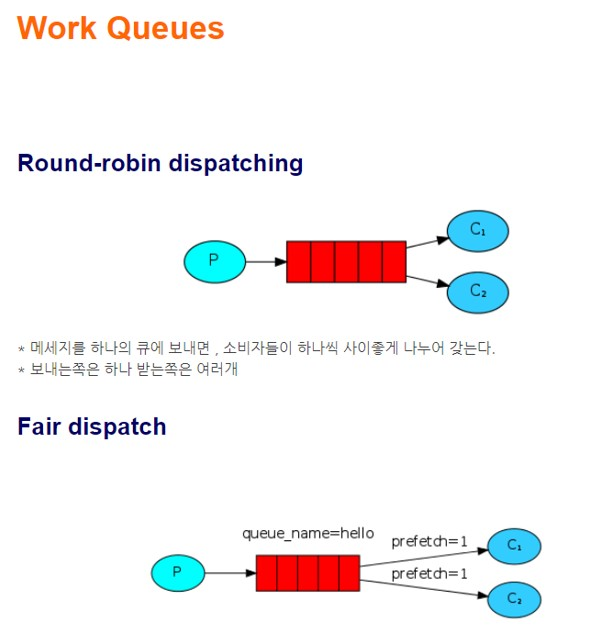
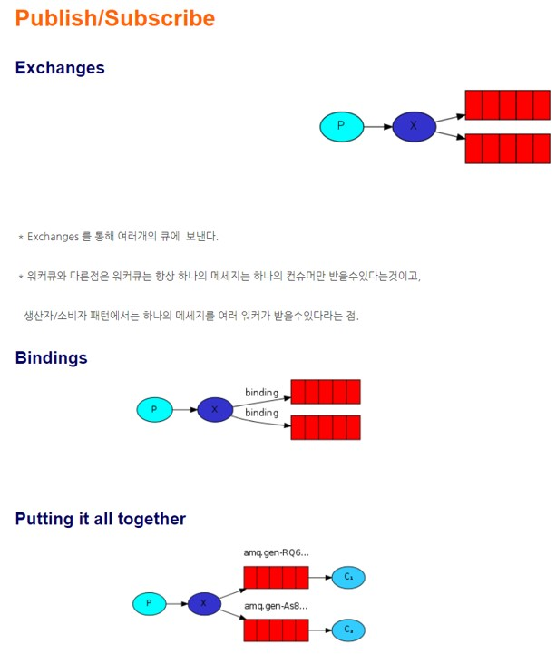
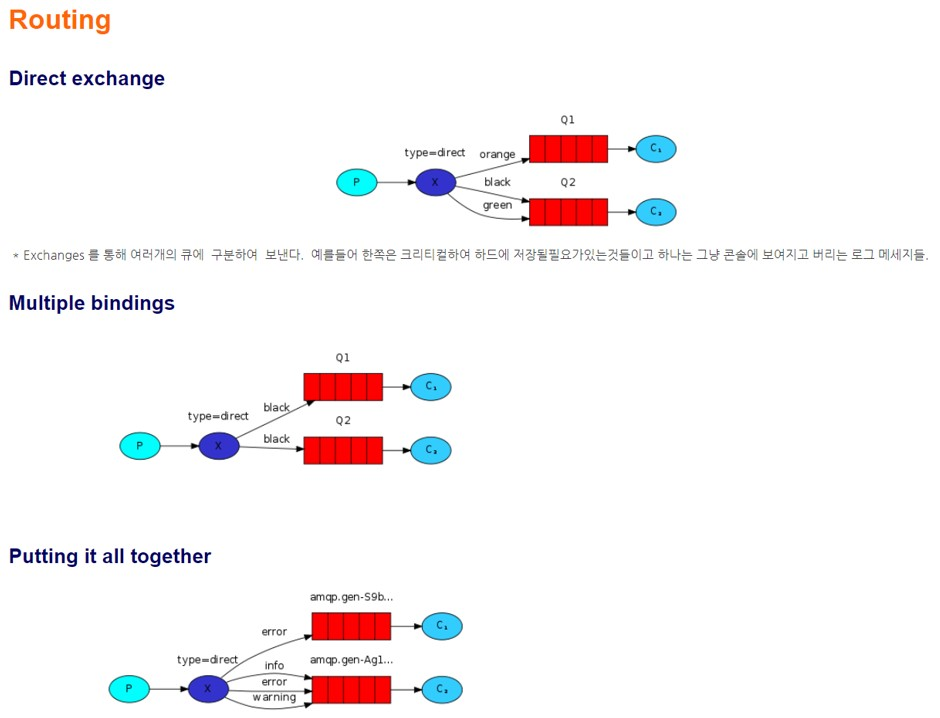
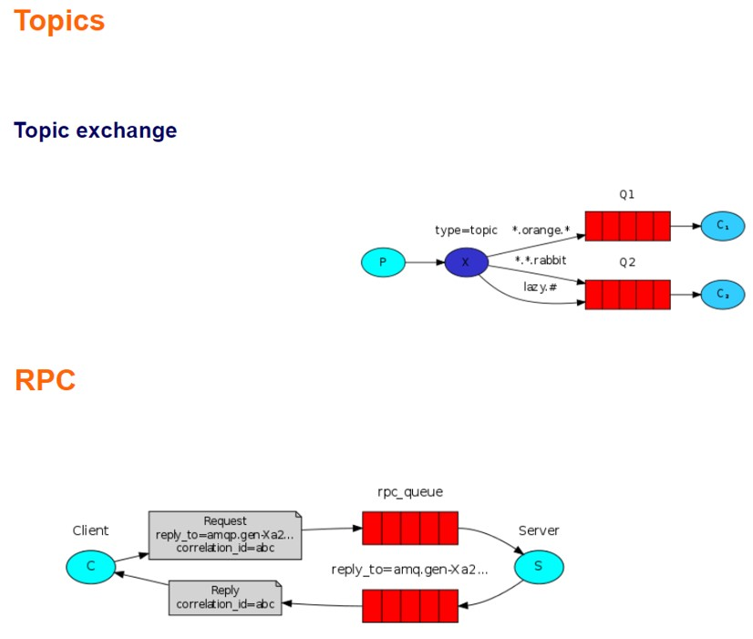
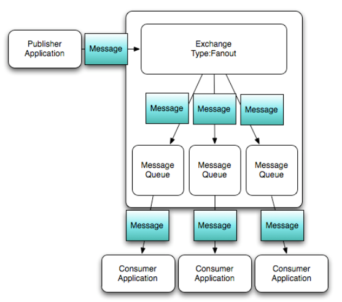
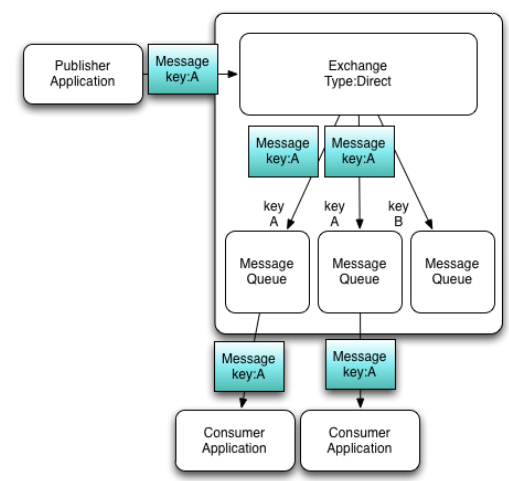
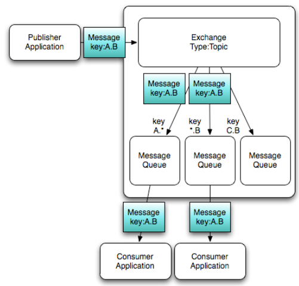

# 사용 패턴
출처: https://kakakakakku.hatenablog.com/entry/2015/08/26/000853  
프로그래밍 언어는 간단하게 구현하기 위해 루비를 사용했다.  
  
  
  
  
  
  

## 1. "Hello World!"
send.rb 에서 메시지를 publish 하면 Queue 에 담긴다.  
```
➜  ~  rabbitmqctl list_queues
Listing queues ...
hello   1
```  
  
receive.rb 에서 메시지를 subscribe 하면 Queue 에서 삭제된다.  
```
➜  ~  rabbitmqctl list_queues
Listing queues ...
hello   0
```  
     
  

## 2. Work queues
### Round-robin dispatching
Consumer를 Work queues로서 사용하는 예  
먼저 라운드 로빈 행동을 확인하기 위해 Work queues를 3개 실행하고, 아래의 명령어를 실행한다.   
  
```
ruby new_task.rb First message.
ruby new_task.rb Second message..
ruby new_task.rb Third message...
ruby new_task.rb Fourth message....
ruby new_task.rb Fifth message.....
```  
  
```  
# Worker_1
[x] Received 'First message.'
[x] Done
[x] Received 'Fourth message....'
[x] Done

# Worker_2
[x] Received 'Second message..'
[x] Done
[x] Received 'Fifth message.....'
[x] Done

# Worker_3
[x] Received 'Third message...'
[x] Done
```  
  
정확하게 라운드로빈으로 메시지가 배송 되었다.  
  
### Message acknowledgment
default 설정으로는 Worker가 죽어버리면 메시지도 모두 사라지므로 이것을 방지하고 싶다면 Consumer에서 Ack을 돌려주지 않으면 메시지를 남기도록 하는 설정을 할 수 있고, 이것을 Message acknowledgment 라고 말한다.  
  
```
q.subscribe(:manual_ack => true, :block => true) do |delivery_info, properties, body|
  # （中略）
end
```  
  
`:manual_ack => true`를 명시하는 것만으로 설정할 수 있다. 즉 `:ack => true`는 이미 DEPRECATION 이므로 사용할 수는 있지만  WARNING이 나오므로 주의한다.  
  
### Message durability
Ack로 Worker의 죽음을 알더라도 RabbitMQ 자체가 죽어버린다면 메시지를 유실하기 때문에 Queue를 영속화 하는 durable 이라는 설정이 있다. 기본적으로는 durable를 사용하지 않는다. Producer 와 Consumer 쌍방에서 `:durable => true`을 설정해야 한다.  
또한 Queue 뿐만이 아닌 메시지까지 영속화 하는 경우는 publish 할 때에 `:persistent => true`로 해야 한다. 기본적으로 true가 좋다고 생각한다.  
```
q = ch.queue("task_queue", :durable => true)
# （中略）
q.publish(msg, :persistent => true)
``` 
     
### Fair dispatch
prefetch를 지정하면 Consumer에서 1번에 페치하는 메시지 수를 정할 수 있다. 메시지의 밸런스에 의해 일부 Worker의 부하가 높게 되어 버리는 경우에 임의의 수를 지정한다.  
```
ch.prefetch(1)
```
  


## 3. Publish/Subscribe
여기에서 Producer/Queue/Consumer 에 이어서 Exchange 라는 개념이 나온다. Exchange는 그 이름대로 Producer에서 흘러온 메시지를 중개해서 복수의 Queue에 배송하는 기능을 가리킨다.  
  
Exchange 에는 복수의 고객이 있다. 
- direct
- topic
- headers
- fanout
  
먼저 fanout를 알아본다.    
  
fanout은 「넓히는」이라는 느낌의 의미로 접속 되어 있는 모든 Queue에 Binding 한다. 복수의 Consumer 에서 같은 메시지를 받을 수 있다.  
```
x = ch.fanout("logs")
q = ch.queue("", :exclusive => true)
q.bind(x)
```  
  
복수의 터미널에서 receive_logs.rb를 실행시킨 상태에서 메시지를 전송하면 모든 Consumer에서 같은 메시지를 받을 수 있다.  
```
ruby receive_logs.rb
 [*] Waiting for logs. To exit press CTRL+C
 [x] Hello World!
```    
    
  
  

## 4. Routing
다음으로 Exchange의 direct를 사용하여 Routing Key 에 매치한 메시지를 배송한다.  
  
Producer 측에서 routing_key를 지정하고 publish 해서, Consumer 측에서도 routing_key를 지정하여 Binding 한다．  
```
x.publish(msg, :routing_key => severity)
```  
  
```  
ARGV.each do |severity|
  q.bind(x, :routing_key => severity)
end
```  
  
실제로 로그의 접두어에 있는 INFO / WARN / ERROR 의 Routing Key로 배송하는 Consumer를 나눌 수 있다.          
  
     
  
## 5. Topics
다음으로 Exchange의 topic을 사용한다. direct 보다도 유연하게 Routing Key 설정을 할 수 있고, 구체적으로는  . 로 계층화 하거나, # 으로 정규표현적인 패턴 매치할 수 있다.  
  
아래의 4 종류의 Worker를 기동하고 kern.critical를 지정하면 모든 Worker에 메시지가 배송된다.  
  
```  
ruby receive_logs_topic.rb "#"
ruby receive_logs_topic.rb "kern.*"
ruby receive_logs_topic.rb "*.critical"
ruby receive_logs_topic.rb "kern.*" "*.critical"
```  
```
ruby emit_log_topic.rb "kern.critical" "A critical kernel error"
```
    
  
    
  
## 6. RPC
마지막으로 RPC. 리모트 서버의 피보나치 계산을 호출할 수 있었다.  
```
ruby rpc_client.rb
 [x] Requesting fib(30)
 [.] Got 832040
 ```
   
```   
ruby rpc_server.rb
 [x] Awaiting RPC requests
 [.] fib(30)
 ```  
   