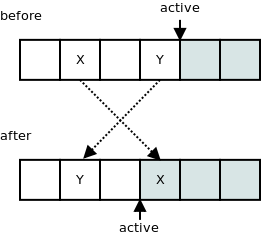

# ZeroMq
- [공식 사이트(한글)](http://kr.zeromq.org/ )
- [기초 소개(한글)](http://kr.zeromq.org/page:read-the-manual )
- [The Guide(한글)](http://kr.zeromq.org/guide:start )
- [Zeromq에 대해서(한글)](http://blog.naver.com/haje01/130133918260 )
- [ZeroMQ/libzmq의 내부 구조(한글)](http://www.potatogim.net/wiki/ZeroMQ/libzmq%EC%9D%98_%EB%82%B4%EB%B6%80_%EA%B5%AC%EC%A1%B0  )
- [ZeroMQ/소켓과 패턴(한글)](http://www.potatogim.net/wiki/ZeroMQ/%EC%86%8C%EC%BC%93%EA%B3%BC_%ED%8C%A8%ED%84%B4 )
- [ZeroMQ 정리](https://hyojabal.tistory.com/7 )
- [AOSA의 내용중 ZeroMQ에 대한 내용 요약](http://happyhourguide.blogspot.com/2015/06/aosa-zeromq.html )
- [ZeroMQ 설명 및 파이썬 예제](https://github.com/goddes4/python-study-wiki/wiki/ZeroMQ )
- [ZeroMQ API](http://api.zeromq.org/ )
- [Github](https://github.com/zeromq )
    - [Corelib](https://github.com/zeromq/libzmq  )
    - [Learning and Using ØMQ](https://github.com/booksbyus/zguide )
    - [예제코드](https://github.com/booksbyus/zguide/tree/master/examples )
  
   
   
## 소개
- N-N 통신을 구현하는 socket API풍의 경량 메시지 라이브러리
- 자동적으로 재접속이나 메시지 큐잉을 해 준다
- 복수의 메시징 패턴 이라는 것을 조합하여 유연한 메시징 배신을 할 수 있다.
- 오픈소스
- Windows(select) 및 리눅스(epoll) 계열 지원.
* C++로 만들었음
* 리눅스의 네트웍 라이브러리의 표준이 되자는 목표를 가지고 시작
* C#, Java, 파이썬 등의 다양한 언어 지원
  
  
## 특징
- 퍼포먼스
    - ZeroMQ는 정말 빠르다. 
    - 그것은 대부분의 AMQP(역자: Advanced Message Queuing Protocol )들 보다 단위가 다를 정도로 빠르다. 이러한 퍼포먼스는 다음과 같은 테크닉들 때문에 가능하다:
    - AMQP처럼 과도하게 복잡한 프로토콜이 없다.
    - 신뢰성 있는 멀티캐스트나 Y-suite IPC 전송 같은 효율적인 전송을 활용한다.
    - 지능적인 메시지 묶음을 활용한다. 이것은 0MQ로 하여금 프로토콜 오버헤드뿐만 아니라 시스템 호출을 줄여서 TCP/IP를 효율적으로 활용하게 한다.
- 단순성
    - API는 믿을 수 없을 정도로 간단하다. 그렇기에 소켓 버퍼에 계속 '값을 채워' 주어야 하는 생 소켓 방식에 비교하면 메시지를 보내는 것이 정말로 단순하다. ZeroMQ에서는 그냥 비동기 send 호출을 부르기만 하면, 메시지를 별도의 스레드의 큐에 넣고 필요한 모든 일을 해준다. 이러한 비동기 특성이 있기에 당신의 애플리케이션은 메시지가 처리되기를 기다리며 시간 낭비하지 않아도 된다. 0MQ의 비동기 특성은 이벤트 중심의 프레임웍에도 최적이다.
    - ZeroMQ의 단순한 와이어 프로토콜은 다양한 전송 프로토콜이 사용되는 요즘에 적합하다. AMQP를 쓴다면 그 위에 또 다른 프로토콜 레이어를 쓴다는 것은 좀 이상하게 느껴진다. 0MQ는 메시지를 그냥 Blob으로 보기에 당신이 메시지를 어떻게 인코드하든 상관없다. 단순히 JSON 메시지들을 보내던지, 아니면 BSON, Protocol Buffers나 Thrift 같은 바이너리 방식 메시지들도 괜찮다.
- 확장성
    - ZeroMQ 소켓들은 저수준처럼 보이지만 사실은 다양한 기능들을 제공한다. 예를 들어 하나의 ZeroMQ 소켓은 복수의 접점을 가질 수 있으며 그들 간에 자동으로 메시지 부하 분산을 수행한다. 또는 하나의 소켓으로 복수의 소스에서 메시지들을 받아들이는 게이트 역할을 할 수도 있다.
    - ZeroMQ는 '브로커없는 설계' 방식을 따르기에 전체의 실패를 초래하는 단일 위치가 존재하지 않는다. 이것과 앞에서 설명한 단순함 그리고 퍼포먼스를 조합하면 당신의 애플리케이션에 분산처리 기능을 넣을 수 있다.
  

## 사상 
Oreilly 책에서  

1. Lock 하지 않고, 하지 못한다
2. 바퀴를 재발견 하고 싶지않다!
3. 풍부한 기능 보다 낮은 계층의 높은 완성도와 성능 
  
### 1. Lock 하지 않고, 하지 못한다
병렬 처리를 구현하기 위해 피할 수 없는 것이 동기화 문제이다.   
여러 코어, 여러 서버에서 병렬로 처리를 실시 할 때 데이터 불일치를 발생하지 않도록 대기 처리로 잠금 처리의 구현이 필요하다.   
스레드에서 synchronized 블록을 작성하거나 여러 서버에 의뢰한 작업을 완료 플래그로 관리하는 등 병렬 처리의 구현에서는 다채로운 수법이다.  
  
ØMQ는 어쨌든이 락을 싫어한다.   
"잠금 따위 사용하면 잠긴 점이 단일 장애 지점이 되어 견고성이 떨어지고, 무엇보다 확장의 병목이 된다!"  
라고 극력 잠금 처리의 구현을 하지 않는 구현을 고집하였다.  
  
이 조건은 ØMQ 자체가 "many 코어, 대량 서버에서 병렬 처리에 있어서 쉽게 확장한다'는 목표를 추구하고 있기 때문이다.   
"잠금을 하지 않으면 실현 될 수 없다면 제공 하지 않는 것은?"라고 잠금을 피하기 위해 기능을 제한하고 있다라고 생각 될만큼 철저히 하고 있다.  
이 덕분에 병렬 처리에 굉장히 강하지만, "어? 이게 없어?" 라고 기능의 편차가 있기도 하다.  
  
### 2. 바퀴를 재발견 하고 싶지않다!
ØMQ는 범용성을 중요시 하고 있다.   
지금까지 병렬 분산 처리를 실현한 소프트웨어는 이것 전용의 병렬 처리 구현을 매번 만들어지고, 버그의 온상이 되기 쉽다.   
만는 것도, 사용하는 것도 큰 고생이다.   
ØMQ 관련 문서에서는 때때로 Apache ZooKeeper와의 비교가 다소 있지만,  
병렬 처리의 실현을 위해, 복잡하고 유지 보수 낮은 재사용하기 어려운 구현이 ZooKeeper에 제공되는 것을 문제 시 하고 있다.  
  
따라서 ØMQ는 재사용 할 수 있는 다양한 장소에서 사용하는 것을 중시하고 있다.   
많은 프로그래밍 언어, 플랫폼에 대응하고 있는 것도 이 때문이다.  
  
그러나 이 생각도 "병렬 분산 처리에 필요한 기능을 제공한다"는 것이 목적이다.   
따라서 "어디에서도 사용할 수 있다"라는 의미의 다양성이 아니라 "병렬 분산 처리로 구현이 어려운 부분을 누구나 쉽게 사용할 수 있도록 했다"라는 의미가 강하다.  
  
### 3. 풍부한 기능 보다 낮은 계층의 높은 완성도와 성능
특화된 목적을 가진 소프트웨어를 위해 제공하는 기능은 생각 외로 한정되어 있다.   
사용하기 시작하면 첫 번째 곤란한 부분은 아래 2가지 이다.
1. 시리얼라이즈를 가지고 있지 않다
2. 재전송 처리가 없다
    
모두 ØMQ를 사용 측이 자기 부담으로 준비 할 필요가 있다.   
ØMQ를 사용하는 Storm에서도 재전송 처리는 자기 부담으로 꽤 힘을 들여서 구현하고 있다.  
아무래도 ØMQ는 응용 프로그램의 목적에 의해 실현 방법이 크게 바뀌어 버릴 것 같은 기능은 제공 할 생각이 없는 것 같다.  
더 낮은 계층의 성능을 추구하는데 주력하고 있기 때문에 제공 되는 기능은 자연스럽게 치우쳐져 있다.   
대신 어디서든 사용할 수있고, 고성능 Pub/Sub를 손쉽게 사용할 수 있다.    
      
  
## 라이브러리 기능
- socket API와 비슷한 C API를 가진다. socket은 zeromq의 socket을 가리킨다.
- zeromq는 컨텍스트라는 것을 통해서 통신을 한다. 1 컨텍스트에 I/O 스레드가 하나 할당 된다. 기본 하나의 프로세스에 하나의 컨텍스트로 OK. 복수의 context를 가질 수 있으면 이 경우 같은 개수의 I/O 스레드가 실행된다.
- zeromq의 socket은 프로세스 내 통신(스레득간 통신 등), 프로세스간 통신, TCP, UDP 멀티캐스트를 랩핑한 것이 있다. icp:my.server나, tcp:127.0.0.1:1234와 같이 통신할 곳을 설정할 수 있다.
- 통신에서는 메시지를 주고 받는다. 메시지는 복수는 프레임에서 된다. 하나의 프레임은 하나의 길이가 있는 바이너리를 가진다.
- 하나의 socket에서 N-N 통신을 할 수 있다.
- 하나의 노드는 복수의 socket을 가질 수 있다.
- zeromq의 socket은 진짜 socket과는 다르다. 클라이언트를 먼저 실행 할 수도 있다. 
- 접속에는 메시징 패턴이라는 것을 설정 되고 있다. 패턴에 의해서 메시지 송수신 방법이 달라진다.
- 서버는 데이터 송수신, 클라이언트 데이터 수신자자 아니다. 어디까지나 메시징 패턴에 기초를 둔 메시지 통신을 한다.
- 노드는 동적으로 추가 할 수 있다.
- 메시징 패턴이 준비한 메타 정보를 제외하고 zeromq는 메시지 내용을 관여하지 않는다.
    
### 큐에 대해
- 메시지는 메시징 패턴에 따라 송신시 · 수신시 큐잉된다.
- 큐는 lock-less로 기본 on memory.
- 전송 큐에 쌓인 메시지는 I/O 스레드가 보내 준다. 비동기 I/O가 사용된다.
- 메시지 전송 API는 단순히 메시지를 전송 큐에 넣는 것만.
- I/O 스레드가 메시지는 수신 큐로 계속 수신해준다. 비동기 I/O가 사용된다.
- 메시지 수신 API는 단순히 메시지를 수신 큐에서 읽을뿐.
- 큐의 크기를 지정할 수 있다.
- ZMQ_SWAP 옵션으로 메모리 상의 큐에서 넘치는 메시지를 디스크로 내보낼 수있다. 그러나 이 파일을 재사용 할 수 없다. 어디까지나 임시 영역으로 디스크를 사용할 뿐.  
   

### 소켓 API
ZeroMQ는 BSD 소켓과 유사한 생명 주기를 갖는다.  
  
소켓의 생성과 파괴(zmq_socket(), zmq_close()). 이는 소켓의 생명 주기에 항상 동반된다.  
필요에 따른 검사나 설정을 통한 소켓 설정(zmq_setsockopt(), zmq_getsockopt()).  
ZeroMQ 연결을 생성함으로써 네트워크 토폴로지에(혹은 네트워크 토폴로지로부터) 소켓을 연결(zmq_bind(), zmq_connect()).  
소켓에 메시지를 송수신함으로써 데이터를 전송. (zmq_msg_send(), zmq_msg_recv())
C를 기준으로 ZeroMQ 소켓은 항상 void 포인터이며, 메시지는 구조체다. 따라서 보통의 소켓처럼 전달하면 되지만, 메시지를 기반으로 하는 모든 작업(zmq_msg_send(), zmq_msg_recv()와 같은)에는 그 메시지의 주소를 전달한다. 이는 "ZeroMQ에서 모든 소켓은 우리에게 속하지만, 메시지는 네 코드에 있는 네 것이다."로 연상할 수 있다.  
  
소켓을 생성, 파괴, 설정하는 등의 동작은 모두 여느 소켓과 다르지 않다. 하지만 ZeroMQ는 비동기적이며 탄력적이다. 이는 이후에 우리가 네트워크 토폴로지에 어떻게 소켓을 연결하고, 또 사용할 것인지에 몇 가지 영향을 미친다.  

  
## 컨텍스트와 소켓
ZeroMQ는 프로그래밍 단위마다 '컨텍스트'가 필요하다(기본적으로 프로세스 당이지만 스레드 마다 준비 하여도 문제는 없다).   
이것은 I/O 스레드의 동작 등의 구체적인 처리를 담당해 준다.  
사용자 프로그램의 요구에 따라 컨텍스트에서 "소켓"이 제공된다. 이것은 TCP 소켓 같은 것이 라기보다는 오히려 "메시지 송수신을 위한 범용 창구」라고 생각하는 것이 좋다.  
  
  
## 메시지 구조
기본은 "ZeroMQ String"이라는 구조(바이트 수 + 실제 바이트 열). 이것을를 이어가는 것으로 통신 단위(메시지 패킷)을 만든다.  
패킷의 최소 구조는 "주소 + 메시지 프레임"이라는 구조. 실제로 쌍방을 구별하기 위해 둘 사이에 스페이서(빈 프레임)가 들어간다. 즉 최소 패킷은 "주소 + 빈 프레임 + 바디 프레임'이라는 구조.  
후술하는 바와 같이, 메시지 프레임을 여러 붙인 "multipart 메시지'라는 형태의 패킷을 전송할 수도 있다.  
이 경우 역시 개별 바디 사이에 스페이서를 붙여 "주소 + 빈 프레임 + 바디 1+ 빈 프레임 + 바디 2 ... '라는 형태로 한다.  
  
덧붙여서 ZeroMQ는 쓰기 잘 만들어져 있기 때문에, 실제의 소켓 프로그래밍에서는 ROUTER와 DEALER(모두 후술)를 사용하지 않는한 "주소" 부분을 처리 할 필요는 없다. 메시지 본문을 send 하면 패킷이 제대로 전송되고, 수신된 패킷의 첫 번째 recv에서는 (첫 번째)메시지 바디를 얻을 수 있다.  
  

## 메시지 교환
하나하나의 메시지 패킷의 send는 비동기적으로 이루어진다.  
- 전송이 끝날 때까지 차단 된다는 것이 없다.
- 연결 상태 및 송수신은 컨텍스트 I/O 스레드에 의해 관리된다.
- 예를들어 send를 호출한 단계에서 연결이 존재하지 않아도, 처리는 블록되지 않으며 오류도 일어나지 않는다. 연결이 성립한 단계에서 I/O 스레드가 메시지를 전송한다. (다만 recv는 상대로부터 메시지가 돌아올 때까지 블록된다)  
  
이상에서 사용자 프로그램 측은 send 이후의 처리에 대해 걱정하지 않고 다른 작업에 들어갈 수 있다. 분산 프로그램에서 뒤에 남는 문제는 '상대방의 오류를 어떻게 감지하고, 그에 따라 이쪽의 처리를 어떻게 회복시킬 것인가"(= 프로그램의 신뢰성)라는 점만된다.  
  
덧붙여서 하나의 패킷은 분할되지 않고 함께 전달된다. 수신 측에서도 하나의 패킷의 정리가 완전히 수신 될 때까지 recv에서 읽어지지 않는다. 그런 의미에서 '패킷'을 원자 처리 단위라고 할 수 있다.  
  
  
## 일반 소켓 프로그래밍과 다른 점
### 연결 또는 분리는 내부에서 관리
일반 소켓 프로그래밍에서는 서버가 받지 않으면 클라이언트는 타임 아웃 후 처리를 중지한다.   
서버가 중간에 중단 되도 마찬가지다.     
항상 대기를 하기 위해서는 응용 프로그램 측에서 연결 이상 · 통신 이상을 고려한 구현이 필요하다.  
ØMQ는 연결 · 절단 부분은 내부에서 관리 되고 있다.   
클라이언트와 서버는 통신을 할 수 있도록 기다린다.  
한편, **연결 또는 분리를 API 외부에서 관리 하는 것은 거의 할 수 없게 되어 있다**.   
기능으로는 볼 수 있지만 제한적이므로 정확한 연결 또는 분리 처리를 하고 싶은 경우에는 다른 라이브러리를 사용하는 것이 좋다.   
  
### 통신 방식이 바뀌어도 동일한 API를 사용할 수 있다
ØMQ는 TCP 외에 UDP 프로세스간 통신, 프로세스간 통신도 통신 방식으로 제공하고 있다.   
그리고 이들은 zmq_bind 문자열을 변경하면 동일한 API를 사용하여 사용할 수 있다.  
다양한 통신 방식에 정의 변경만으로 대응할 수 있는 시스템 구성으로 최적의 통신 방식이 바뀔 가능성이 있는 분산 병렬 처리 환경에서 매우 편리하다.  
또한 프로세스간 통신은 UNIX 도메인 소켓을 사용하고 있기 때문에 현재 Windows에서 작동하지 않는다(Windows 10 2017년 빌드부터는 가능할 듯).   
프로세스간 통신은 동일한 프로세스 내의 스레드간 통신으로 제한되므로 주의하기 바란다.  
    
  
## Multipart의 메시지
복수의 "메시지 프레임(본체)"를 가진 메시지 처리는 "multipart"라고 부른다.  
- 전송 시 zmq_msg_send()에 ZMQ_SNDMORE 플래그를 설정하여, 후속 메시지 프레임과 연결시킬 수 있다.  
- 보내는 I/O thread는 후속 프레임이 모두 갖추어질 때까지 전송 처리를 시작하지 않는다(경우에 따라 "모이면 바로 시작"한다고 할 수 없다).  
- 수신 I/O 스레드는 모든 프레임을 수신 할 때까지 zmq_msg_recv()로 수신 할 수 없다.
- 수신 프로그램은 zmq_msg_more()을 이용하여 후속이 있는지를 체크 할 수 있다.
  

## 네트워크 토폴로지에 소켓 연결하기
두 노드 간에 연결을 만들기 위해서는 한 노드에서는 zmq_bind()를, 다른 노드에서는 zmq_connect()를 사용한다.   
일반적으로 "서버"라고 부르는 zmq_bind()를 수행한 노드는 다른 노드에서 접근 가능한 알려진 네트워크 주소를 쥐고 있고, "클라이언트"라고 부르는 zmq_connect()를 수행한 노드는 임의의 네트워크 주소를 갖는다.   
따라서 여기에서는 이를 두고 "종점에 소켓을 묶는다(bind)" 혹은 "종점에 소켓을 연결한다."라고 하는데, 이 종점(endpoint)은 알려진 네트워크 주소를 쥔 녀석이 된다.  
  
ZeroMQ의 연결은 기존의 TCP 연결에 비해 눈에 띄는 몇 가지의 다른 것들이 있다.  
- 다양한 전송 방식을 사용한다.
    - inproc: ZeroMQ 로컬 프로세스 내부(스레드 간)의 통신[2]
    - ipc: ZeroMQ 로컬 프로세스 간의 통신
    - tcp: TCP를 사용한 ZMQ 유니캐스트 통신
    - pgm: PGM을 사용한 ZMQ 신뢰성 멀티캐스트 통신[3]
    - epgm: ZeroMQ에서 자체 정의한 EPGM(Encapsulate PGM)을 사용한 통신[4]
- 하나의 소켓은 다수의 들어오거나 나가는 연결들을 가질 수 있다.
- zmq_accept() 함수는 존재하지 않는다. 소켓이 종점과 묶이면 연결의 수용은 자동으로 수행한다.
- 네트워크 연결은 뒤쪽에서 자동으로 이루어지고, ZeroMQ는 이 연결이 중단될 경우 자동으로 다시 이 끊어진 연결을 수행한다. (예를 들어, 피어가 잠시 연결이 중단됐다가 다시 복원된 경우)
- 무른모의 코드는 앞서 언급된 연결들에 대해 직접적으로 제어할 수 없다. 이런 동작들은 소켓 내에서 은닉되어 있다.
  
많은 아키텍처에서는 클라이언트/서버 모델을 따르고, 이들에 따르면 zmq_bind()는 서버, zmq_connect()는 클라이언트다. 하지만 ZeroMQ에서는 이런 모델을 소켓의 유형이 뭐냐에 따라 달라지는데 이는 차후 다시 보도록 하자.  
    

## ZeroMQ로 메시징 레이어 구현하기
- 전송 방식 정하기
    - INPROC  프로세스내 전송 모델
    - IPC  프로세스 간 전송 모델
    - MULTICAST  PGM를 통한 멀티캐스트 (UDP로 싸여지기도 함)
    - TCP  네트워크 기반의 전송
- 하부 구조 잡기
    - QUEUE  요청/답변(Request/Reply) 메시징 패턴을 위한 발송자
    - FORWARDER  발행/구독(Publish/Subscribe) 메시징 패턴을 위한 발송자
    - STREAMER  파이프라인의 단방향 메시징 패턴을 위한 발송자

- 메시지 패턴을 선택하기
    - REQUEST/REPLY  양방향, 부하 분산과 상태 기반
    - PUBLISH/SUBSCRIBE  다수의 구독자들에게 한번에 발행
    - UPSTREAM / DOWNSTREAM  파이프라인의 접점들에 단일 방향 데이터 배포
    - PAIR  두 피어들 간 배타적 커뮤니케이션
   

## 소켓 타입
- PUB : SUB에 데이터를 넘긴다. 수신 불가능.
- SUB : PUB으로부터 데이터를 받는다. 송신 불가능.
- XPUB : PUB을 중계한다.
- XSUB : SUB을 중계한다.
- ROUTER : REQ으로부터 패킷을 받는다. 전달 메시지는 multipart식으로 되며, 특수한 자체 프레임으로 변형된다.
- DEALER : REP에게 패킷을 보낸다. PUSH와 같이 패킷은 분배한다.
- REQ : 동기 방식의 요청용 소켓.
- REP : 동기 방식의 응답용 소켓.
- PUSH : 데이터 분배 송신용 소켓.
- PULL : 데이터 분배 수신용 소켓.
- PIAR : 내부 프로세스간 통신할 때 사용하는 소켓. inproc 통신.
  
### 역할 의존적인 소켓 처리 전략 패턴
- 소켓 처리 전략은 소켓 생성 시에 설정한다.
- 역할에 따라 기본 처리 패턴(메시지를 처리하는 방법이나 연결이 끊어진 경우에 어떻게 할 것인가 라든지)가 알려져 있다. ZeroMQ 상의 처리 전략은 이 패턴의 역할 이름으로 설정할 수 있다:  
  
| 이름   | bind 여부 | 대 1 / 대 N | Write-first | Read-first   | 라우팅 | 대표적인 연결 상대 |
|--------|-----------|-------------|-------------|--------------|--------|--------------------|
| REP    | ○         | 대 N        | ×           | ○            | ×      | REQ                |
| REQ    | ×         | 대 N        | ○           | ×            | ×      | REP                |
| PUB    | ○         | 대 N        | ○           | (Write-only) | ×      | SUB                |
| XPUB   | ○         | 대 N        | ○           | (Write-only) | ×      | SUB                |
| SUB    | ×         | 대 N        | (Read-only) | ○            | ×      | PUB                |
| XSUB   | ×         | 대 N        | (Read-only) | ○            | ×      | PUB                |
| PUSH   | ○         | 대 N        | ○           | (Write-only) | ×      | PULL               |
| PULL   | ○         | 대 N        | (Read-only) | ○            | ×      | PUSH               |
| ROUTER | ○         | 대 N        | ×           | ○            | ○      | REQ                |
| DEALER | ○         | 대 N        | ○           | ×            | ○      | REP                |
| PAIR   | ○         | 대 1        | two-way     | two-way      | ×      | PAIR               |
  
  
## 메시지 패턴
[자세한 설명](message_pattern.md) 
   
    
## Device
- 메시징 패턴끼리를 중개하는 노드를 Device라고 부른다.
- zeromq는 몇 개의 내장 Device를 가진다.
- 내장 Device QUEUE는 REQ로부터 받은 요청을 여러 REP로 전송하고 그 결과를 REQ에 반환하는 Device.
- 내장 Device FORWARDER는 PUB/SUB를 재전송 한다. PUB/SUB를 확장하려면, 트리 구조 통신을 할 필요가 있다. 이 때 뿌리 노드 이외의 내부 노드로 사용할 수 있다.
- 내장 Device STREAMER는 PUSH/PULL에서 FORWARDER의 역할이다.
- 메시징 패턴의 조합으로 PUB-SUB, REQ-REP, REQ-XREP, XREQ-REP, XREQ-XREP, XREQ-XREQ, XREP-XREP, PUSH-PULL, PAIR-PAIR가 존재한다.
이러한 메시징 패턴을 조합하여 다양한 토폴로지 및 라우팅 등을 실현할 수 있다.
  
  
   
  
  
## 내부 구조  
출처
- https://potatogim.net/wiki/ZeroMQ/libzmq%EC%9D%98_%EB%82%B4%EB%B6%80_%EA%B5%AC%EC%A1%B0
  

### 스레드 모델
우선, OS의 관점에서 보는 ØMQ는 2가지의 스레드가 있다.  
- 애플리케이션 스레드: ØMQ 외부에서 만들어지고, API 접근에 사용된다.
- I/O 스레드: ØMQ 내부에서 만들어지고, 백그라운드에서 메시지를 주고 받는 데에 사용된다.
  
ØMQ의 관점에서 스레드는 '우편함(mailbox)'을 갖는 어떤 객체다. 여기서 우편함은 해당 스레드에 있는 모든 객체에 보냈던 명령들을 담고 있는 큐다.   
스레드는 이 우편함에서 명령을 찾아서 보낸 순서대로 하나씩 처리한다.  
  
ØMQ에 관한 2가지 스레드가 있는데 하나는 I/O 스레드이고, 다른 하나는 소켓(socket)이다.  
I/O 스레드는 운영 체제 스레드와 대응되고, 명령 수신을 위한 하나의 우편함을 갖고 동작한다. 소켓은 묘하게 좀 더 복잡한 구석이 있다. 각 ØMQ 소켓은 명령 수신을 위한 자신의 우편함을 갖고, 분리된 스레드로서 처리된다.  
실제로 하나의 애플리케이션 스레드는 다수의 소켓을 만들 수 있는데, 이 경우 다수의 ØMQ 스레드가 하나의 운영 체제 스레드에 대응된다. 여기서 더 복잡하게(!!!) 하면, ØMQ 소켓은 운영체제 스레드 간에서도 이주될 수가 있다.[7] 이 경우, ØMQ 스레드와 운영 체제 스레드 사이의 관계가 변화된다.
  

### I/O 스레드
I/O 스레드는 비동기적으로 네트워크 트래픽을 처리하기 위해 백그라운드 상에서 동작하는 스레드다.  
이 스레드는 io_thread_t 클래스로 구현되어있는데, thread_t 클래스와 object_t 클래스를 상속받는다.  
각 I/O 스레드 내부에는 크게 3개의 객체가 존재한다.  
- poller_t : 폴링 메커니즘 구현
- io_object_t : 입출력 이벤트 관리
- mailbox_t : 우편함
  
  
    
poller_t는 각기 다른 운영 체제에서 구현되는 select(select_t), poll(poll_t), epoll(epoll_t)과 같은 폴링 메커니즘을 제공한다.  
io_object_t는 add_fd()로 파일 기술자를 등록하고, 여기에서 입/출력 이벤트(in_event/out_event)가 발생하면 콜백을 호출하는 역할을 한다.  
등록된 파일 기술자는 rm_fd()를 사용해서 제거할 수 있다. 또한, add_timer()를 사용해서 타이머를 추가할 수도 있는데, 이 타이머는 만료 시에 이벤트(timer_event)가 발생된다.  
등록된 타이머는 cancel_timer()를 사용해서 취소할 수 있다.  
io_thread_t는 자신의 파일 기술자를 폴러에 등록하게 되는데, 이 파일 기술자는 우편함과 연관되어 새로 도착하는 명령에 대해 in_event를 발생시키고, io_thread_t는 대상 객체에 이 명령을 전달한다.  
  

### 객체 트리
ØMQ 라이브러리에서 만드는 내부 객체들은 트리 구조로 조직된다.  
  
  
  
위 그림에서 알 수 있듯이, 트리의 루트는 항상 'socket'인데 각 객체는 다른 스레드 내에 존재할 수도 있다.  
그림에선 애플리케이션 스레드와 I/O 스레드가 분리되어 애플리케이션 스레드에는 socket만이 있고, 이 socket을 2개의 I/O 스레드가 사용하고 있음을 알 수 있다.  
  
이러한 객제 트리의 존재 이유는 결정론적 종료 메커니즘을 제공하기 위한 것이다. 객체는 종료를 위해 종료 요청을 모든 자식들에게 보내고 그 응답을 대기하는데, 이렇게 종료 요청과 응답을 주고 받는 과정에서 두 객체 사이에 진행 중인 명령을 효율적으로 플러시한다. 앞서 나온 대다수의 명령에서 시퀀스 번호가 사용될 필요가 없다는 것은, 이런 메커니즘을 사용하기 때문이다.  
  
객체가 부모의 요청에 의한 것이 아니라 자식이 스스로 종료 처리를 하려는 경우에 종료 처리는 더욱 복잡해진다.  
  
  
    
첫번째 상황이 부모가 자식에게 종료 요청을 개시하는 상황이고, 두번째 상황은 자식이 종료 요청을 개시하는 상황이다.  
마지막 세번째가 특이한 경우라고 할 수가 있겠는데, 동시에 개시한 경우 자식이 보낸 종료 요청(term_req)은 부모가 깔끔하게 씹어드신다.  
객체 트리 메커니즘은 own_t 클래스로 구현되는데, 객체 트리에 있는 모든 객체들은 명령을 송/수신할 수가 있다.  
      
  
### 리퍼 스레드
앞서 나온 종료 메커니즘에는 특별한 문제가 하나 있다.  
어떤 객체가 종료할 때 zmq_close 호출은 POSIX와 유사하게 바로 반환이 되지만, 자식 객체와 모든 핸드 쉐이킹 과정이 완료됐다고 확신할 수가 없다는 점이다.  
  
zmq_close에서 반환된 스레드가 libzmq의 코드가 아닌 전혀 다른 코드를 실행하고 있을 수도 있고, 다시는 여기로 넘어오지 않을 수도 있다. 따라서, 이 소켓은 애플리케이션 스레드 대신에 모든 핸드 쉐이킹을 제어할 수 있는 작업 스레드로 이주되야 한다.  
  
논리적으로는 소켓을 I/O 스레드 중의 하나로 이주시킬 수도 있을 것이다. 하지만, ØMQ는 I/O 스레드가 없이도 초기화 될 수 있다는 점을 기억하자! 그렇기에 이 작업을 할 전용 스레드가 필요하고 그게 바로 리퍼 스레드다.  
  
리퍼 스레드는 reaper_t 클래스로 구현되며, 소켓은 리퍼 스레드에 reap 명령을 송신하고, 명령을 수신한 리퍼 스레드는 이 소켓을 깔끔하게 종료되도록 관리한다.  
  
  
### 메시지
메시지의 조건은 꽤 복잡한 편인데, 이는 아주 크거나 작은 메시지의 효율적인 전송을 구현하기 위한 것이다.  
- 매우 작은 메시지는 힙에 있는 공유 데이터를 유지하는 것보다 메시지를 복사하는 비용이 더 싸다. 그래서 이런 메시지는 따로 연관 버퍼를 가지지 않고, zmq_msg_t 구조체에 직접 데이터가 저장된다.
- inproc 통신을 사용할 때, 메시지는 복사되지 않는다. 따라서, 어떤 한 스레드에 보내진 버퍼는 다른 스레드에서 수신하고 할당을 해제해버린다.
- 메시지는 참조 계수를 지원한다. 어떤 메시지가 다수의 다른 TCP 연결에서 발행됐다면, 이걸 송신하는 모든 스레드(혹은 TCP 연결)는 이 버퍼를 복사하는게 아니라 같은 버퍼에 접근해서 보낸다.
- 같은 방법을 사용자에게도 적용할 수 있는데, 사용자는 내용의 복사를 거치지 않고 같은 물리적 버퍼를 다수의 ØMQ 소켓으로 보낼 수가 있다.
- 사용자는 데이터를 복사할 필요 없이 애플리케이션-지정 할당 메커니즘에 의해 할당된 버퍼를 보낼 수 있다.
  
  
    
매우 작은 메시지(VSM, Very Small Message)에 대한 버퍼는 zmq_msg_t 구조체의 일부인 것을 볼 수 있다. 이 경우, 할당을 위한 별도의 작업이 필요치 않고 content 필드에 ZMQ_VSM 상수를 넣음으로써 VSM이라는 것을 식별할 수가 있다. vsm_size에는 메시지의 길이가 지정되고, vsm_data에는 메시지 데이터가 저장된다.  
  
vsm_data의 최대 크기는 기본 30 바이트로 지정되어 있으며, 이는 ZMQ_MAX_VSM_SIZE 상수로 조정이 가능하다.  
  
    
  
메시지 크기가 ZMQ_MAX_VSM_SIZE를 초과하는 경우라면 힙에 버퍼를 할당하는 것이 메시지 데이터를 복사하는 시간보다 더 싸다고 가정한다. 따라서 ØMQ는 힙에 버퍼를 할당한 다음에 zmq_msg_t 구조체가 그 주소를 가리키도록 한다.  
  
힙에 할당된 구조체는 msg_content_t이며, 이 구조체는 할당된 청크와 관련된 모든 메타데이터를 저장한다.
- data: 할당된 버퍼의 주소를 저장
- size: 버퍼의 크기를 저장
- ffn: 할당 해제에 사용할 함수의 포인터
- hint: 할당 해제 함수에 전달된 인자
- refcnt: 이 msg_content_t에 대한 참조 계수
  
버퍼와 그 메타데이터는 zmq_msg_t 인스턴스 간에 공유될 수도 있는데, 이 버퍼를 가리키는 zmq_msg_t가 없을 때 할당을 해제하기 위해 버퍼의 참조 계수를 유지한다.  
또한 위 그림에서도 나타나는 것처럼, zmq_msg_copy는 실제 데이터를 복사하는게 아니라 새로 zmq_msg_t를 할당한 다음에 같은 버퍼를 가리키기만 하는 동작을 하게 된다.  

    
  
끝으로 사용자가 직접 메모리를 할당한 경우에는, 버퍼의 메타데이터를 같은 메모리 청크에 저장할 수 없기 때문에 메타데이터에 대한 청크를 따로 할당해야 한다.  
  
  
### 파이프
ØMQ에서 메시지는 파이프 배열 상에서 모든 스케줄링 동작이 이루어지고, 파이프의 상태는 2가지로 표현된다.  
- 능동(active) : 메시지를 송/수신할 수 있는 상태
- 수동(passive) : 파이프에서 메시지를 읽을 수가 없어서 더 이상 메시지를 송신할 수 없는 상태
  
위와 같은 표현 방식일 때, 1만 개의 파이프가 있고 이 중에 하나가 수동 상태일 경우를 생각해보면 이 하나를 위해서 9,999개의 파이프를 확인해야 하는 문제가 있다.  
그렇기에 ØMQ에서는 아래 그림에서 보이는 바와 같이 능동 상태에 있는 파이프를 수동 상태에 있는 파이프와 배열 상의 위치를 교환함으로써 항상 능동 상태의 파이프가 앞에 나타나는 알고리즘을 사용했다.  
  
    
  
이런 알고리즘 덕분에 O(1)의 시간복잡도를 유지할 수 있으며, 일일이 능동 상태의 파이프를 찾지 않아도 되는 이점을 얻게 된 것이다.  
    


## 설치
### CentOS
[출처](http://www.a2big.com/_board/content.php?id=1058&pass_id=34&secret=0&slug=resent_new )  
c,c++ 컴파일러가 설치 되지 않았다면 설치한다.  
```
$ yum install gcc gcc-c++ libuuid-devel
```  
  
ZeroMQ 설치  
```
$ wget http://download.zeromq.org/zeromq-4.0.3.tar.gz
$ tar xzf zeromq-4.0.3.tar.gz
$ cd zeromq-4.0.3
$ ./configure
$ make
$ make install
```  
  
설치가 끝나면 /usr/local/lib/ 디렉토리에 libzmq.so 파일이 있는 확인해보자.  
```
[root@localhost opt]# ls /usr/local/lib/libzmq.so
/usr/local/lib/libzmq.so
```
   
  
## 예제 코드
### REQ-RES
서버  
```
#include <zmq.h>

int main () {
  // 0MQ 초기화
  void *context = zmq_ctx_new();

  // 서버용 소켓 생성과 초기화
  void *responder = zmq_socket(context, ZMQ_REP);
  zmq_bind(responder, "tcp://*:5555");

  while (1) {
    // 받는다
    char buffer[10];
    zmq_recv(responder, buffer, 10, 0);

    // 본내다
    zmq_send(responder, "aaaaa", 5, 0);
  }
  return 0;
}
```

클라이언트  
```
#include <zmq.h>

int main () {
  // 0MQ 초기화
  void *context = zmq_ctx_new();

  // 클라이언트용 소켓 생성과 초기화
  void *requester = zmq_socket(context, ZMQ_REQ);
  zmq_connect(requester, "tcp://localhost:5555");

  // 보낸다
  zmq_send (requester, "Hello", 5, 0);

  // 받는다
  char buffer [10];
  zmq_recv (requester, buffer, 10, 0);

  return 0;
}
```       
  
### PubSub
서버    
```
include <zmq.h>
#include <string.h>
#include <stdlib.h>

int main() {
  void *context = zmq_ctx_new();
  // publisher 초기화
  void *publisher = zmq_socket(context, ZMQ_PUB);
  zmq_bind(publisher, "tcp://*:5556");

  while (1) {
    char buffer[20];
    sprintf(buffer, "%d", (int)random());
    zmq_send(publisher, buffer, strlen(buffer), 0);
  }
  return 0;
}
```
    
클라이언트  
```
#include <zmq.h>
#include <string.h>
#include <stdlib.h>
#include <stdio.h>

int main (int argc, char *argv []) {
  void *context = zmq_ctx_new();

  // publisher에 접속
  void *subscriber = zmq_socket(context, ZMQ_SUB);
  zmq_connect(subscriber, "tcp://localhost:5556");

  // 필터를 설정한다
  if (argc > 1) {
    zmq_setsockopt(subscriber, ZMQ_SUBSCRIBE, argv[1], strlen(argv[1]));
  }

  while (1) {
    // 수신한다
    char buffer[256 + 1];
    int size = zmq_recv(subscriber, buffer, 255, 0);
    buffer[size] = '\0';

    puts(buffer);
  }

  return 0;
}
```
  


### 오픈 소스
- [zmq + mggpack](https://gist.github.com/mashiro/5150508)
- [zmq-chat](https://github.com/jnthnwn/zmq-chat )  파이썬 코드
- [a stupid simple command-line chat server and client using zeromq](https://github.com/bradmontgomery/zerochat)  파이썬 코드 
- [leveldb-server](https://github.com/srinikom/leveldb-server/ )


