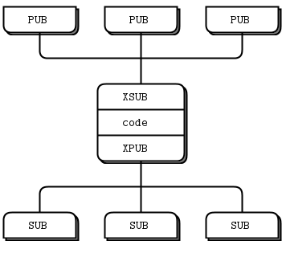

# 메시지 패턴
출처:   
https://potatogim.net/wiki/ZeroMQ/%EC%86%8C%EC%BC%93%EA%B3%BC_%ED%8C%A8%ED%84%B4  
https://hyojabal.tistory.com/7  
   
- 통신 방법(inproc, inter-process, tcp, multicast)에 무관하게 노드를 스레드, 프로세스, 다른 노드에 매핑이 가능하다.
- 자동 재연결 가능
- 송수신자 양측에서 메시지 큐잉 (항상은 아니고 필요에 따라)
- OOM이 발생하는 경우에 대해 프로세스를 보호하기 위해 큐들을 제한한다.
- 소켓 오류 제어
- 모든 I/O는 백그라운드 스레드에서
- 노드 간에 lock free 통신 (잠금, 대기, 세마포어, 데드락 등이 없다!)
  
이런 장점들의 확보를 위해서는 메시지들을 보내거나 큐잉하는 엄밀한 조합법을 따라야 하는데, 여기에선 이를 패턴이라고 한다. 패턴은 어렵사리 얻었던 경험들을 바탕으로 최상의 데이터 및 작업의 분산을 제공한다. 아직까지 ZeroMQ의 패턴은 작성이 어려운 편이지만 향후 버전에서는 사용자 정의 패턴들을 사용할 수 있게될 것이다.  
  
ZeroMQ 패턴들은 조합 가능한 유형의 소켓 쌍으로 구현되며, 기본 내장된 것들은 아래와 같다.  
- Request-Reply, 클라이언트 집합이 서비스 집합에 연결된다. (RPC, 작업 분산 패턴)
- Publish-Subscribe, 발행자(Publisher) 집합이 구독자(Subscriber) 집합에 연결한다. (데이터 분산 패턴)
- Pipeline, 여러 단계와 루프를 갖는 fan-in/fan-out 패턴 안에서 노드들이 연결한다. (병렬 작업 분산 혹은 수집 패턴)
- Exclusive pair, 두 소켓만을 연결하며(exclusively), 한 프로세스 내의 두 스레드를 연결하기 위한 패턴이기에 보통의 소켓 쌍과 혼동해선 안된다.

## 조합 가능한 소켓 쌍들.
- PUB and SUB
- REQ and REP
- REQ and ROUTER
- DEALER and REP
- DEALER and ROUTER
- DEALER and DEALER
- ROUTER and ROUTER
- PUSH and PULL
- PAIR and PAIR
  
이 외에도 XPUB, XSUB도 볼 수가 있는데, 이는 PUB/SUB 소켓의 원시적인 버전이라고 볼 수 있다.)  
  
  
## 상위 수준 메시징 패턴
ZeroMQ 내에는 4가지의 기본 패턴들이 구현되어 있다. 이들은 C++ 라이브러리로 구현된 API의 일부로서, 대다수의 환경에서 사용 가능함을 보장한다.  
  
ZeroMQ의 개발자들은 상위 수준 메시징 패턴들을 기본 패턴 위에 얹었으며, 이런 상위 수준 패턴들은 사용자들이 애플리케이션에서 사용하는 언어에 무관하도록 구현했다. 하지만 이들은 핵심 라이브러리에 속해있지는 않으며, ZeroMQ 커뮤니티 등에서 얻을 수 있다. 대표적인 예는 ØMQ/신뢰성 있는 요청-응답 패턴들에서 볼 수 있는 Majordomo 프로젝트다.  
  
이 문서에서 목표로 하는 바 중에 하나가 바로 크고(어떻게 신뢰성 있는 Pub-Sub 아키텍처를 만드는가?) 작은(어떻게 메시지를 정확하게 다루는가?) 상위 수준 패턴들의 일부를 독자들에게 제공하는 것이다.  
  
  
## 메시지 다루기
libzmq 핵심 라이브러리에는 메시지를 주고 받는 두 개의 API가 있다. zmq_send()와 zmq_recv() 메서드가 이에 해당되는데, zmq_recv()는 가변 길이의 메시지를 다루기에는 부적합하다. 이는 버퍼 크기를 제공하는 것과 무관하게 메시지를 잘라내기 때문인데(truncate), 그렇기에 zmq_msg_t 구조체를 사용하기에 적합한 2차 API를 제공한다.   
- 메시지 초기화 : zmq_msg_init(), zmq_msg_init_size(), zmq_msg_init_data()
- 메시지 송수신 : zmq_msg_send(), zmq_msg_recv()
- 메시지 할당 해제 : zmq_msg_close()
- 메시지 내용 접근 : zmq_msg_data(), zmq_msg_size(), zmq_msg_more()
- 메시지 속성 작업 : zmq_msg_get(), zmq_msg_set()
- 메시지 조작 : zmq_msg_copy(), zmq_msg_move()
  
동작 상에서, ZeroMQ 메시지들은 작게는 0에서부터 크게는 메모리를 꽉 채울 수도 있다. 또한 프로토콜 버퍼, 메시지팩(msgpack), JSON과 같이 애플리케이션이 대화에 필요로 하는 직렬화를 할 수도 있다. 이식성을 위한 데이터 표현을 선택하는 것을 영리하다고 할 수 있지만, 이에 대한 트레이드-오프  
  
메모리 상에서, ZeroMQ 메시지들은 zmq_msg_t 구조체들로 표현된다.[7] C에서 ZeroMQ 메시지를 사용하기 위한 기본 규칙들은 아래와 같다.  
- 데이터 블럭이 아니라 zmq_msg_t 객체를 만들고 넘겨야 한다.
- 메시지를 읽기 위해서는 zmq_msg_init()를 통해 빈 메시지를 만들고, 이를 zmq_msg_recv()로 전달한다.
- 새로운 데이터를 사용하여 메시지를 쓰기 위해서는 zmq_msg_init_size()를 통해 메시지를 만들어 같은 사이즈의 데이터 블럭을 할당한다. 이후 memcpy를 통해 빈 메시지를 채운 다음에 zmq_msg_send()로 메시지를 전달한다.
- 메시지를 해제하기 위해서는 zmq_msg_close()를 호출하여 참조를 버리고, 이후에 ZeroMQ가 이 메시지를 파괴할 것이다.
- 메시지 내용에 접근하기 위해서는 zmq_msg_data()를 사용한다. 데이터의 크기를 알고자 할 때는 zmq_msg_size()를 사용한다.
- 매뉴얼 등을 통해 정확한 사용법과 원리를 이해하기 전에는 zmq_msg_move(), zmq_msg_copy(), zmq_msg_init_data()를 사용하지 않는 것이 좋다.
- zmq_msg_send()에 메시지를 전달한 이후에, ZeroMQ는 메시지의 크기를 0으로 만들어서 치운다. 다시 말해서 같은 메시지를 두번 보낼 수 없으며, 전송한 이후에는 메시지 데이터에 접근할 수 없다는 말이다.
- 앞서 말했듯, 이들은 메시지 구조에만 적용되는 2차 API에 대한 규칙들이기에 바이트 열을 직접 보내고 받는 zmq_send(), zmq_recv()에는 적용되지 않는다.
  
같은 메시지를 연속해서 보내기 위해서는 비용이 많이 들어간다. zmq_msg_init()을 통해 두번째 메시지를 만들어서 초기화를 해야 하고, zmq_msg_copy()를 사용해서 첫번째 메시지를 복사해야 한다. 이제 두번째 메시지를 보낼 수 있으며, 마지막 복사본이 보내지거나 메시지가 닫히면 마침내 이 메시지를 파괴된다.  
  
ZeroMQ는 멀티파트 메시지를 지원하는데, 이는 프레임의 목록을 단일 메시지로서 보내거나 받을 수 있도록 한다. 실제 애플리케이션에서 많이 사용되며 ØMQ/고급 요청-응답 패턴에서 이를 살펴볼 것이다.  
  
프레임(ZeroMQ에서 메시지 파트라고 부르는)은 ZeroMQ 메시지의 기본 직렬화 형식(wire format)이다. 프레임은 길이가 지정된 데이터의 블럭인데, 이 길이는 0에서부터 시작된다. 어떤 형태로든 TCP 프로그래밍을 해봤다면 프레임이 왜 "지금 네트워크 소켓에서 데이터를 얼마나 읽어야 하지?"라는 질문에 대한 답이 되는지 알게될 것이다.  
  
ZMTP라고 불리우는 직렬화 수준의 프로토콜이 있다. 이는 ZeroMQ가 TCP 연결 상에서 어떻게 데이터를 읽고 쓸지를 정의한다. 어떻게 동작하는지에 대해 관심이 있다면 명세가 그리 길지는 않으니 읽어보도록 하자.  
  
원래 ZeroMQ 메시지는 UDP와 같이 하나의 프레임이었다. 나중에 개발자들은 연속되는 프레임들에 대해 "more" 비트가 1로 설정된 프레임들이 있고, 그 뒤에 0으로 설정된 하나의 프레임이 따라오는 단순한 방법으로서 이를 멀티파트 메시지로 확장했다. 따라서 ZeroMQ API는 송신 측에서는 "more" 플래그를 설정하게 하고, 수신하는 쪽에서 "more"가 있는지 확인하게 함으로써 연속된 프레임들을 구별하게 한다.  
  
하위 수준의 ZeroMQ API에서는 메시지와 프레임의 식별이 모호하다. 그래서 아래와 같은 유용한 어휘들이 있다.  
- 메시지는 하나 혹은 여러 부분들이 될 수 있다.
- 이 부분들은 "프레임"이라고 불리운다.
- 각 부분은 zmq_msg_t 객체다.
- 하위 수준 API에서는 각 부분을 독립적으로 보내거나 받을 수 있다.
- 상위 수준 API에서는 멀티파트 메시지들을 일괄적으로 보낼 수 있는 랩퍼를 제공한다.
  
이외에도 알아두면 유용한 메시지에 대한 정보들이 있다.
  
- 한 스레드에서 다른 스레드로 보내는 시그널로서 길이가 0인 메시지를 보낼 수 있다.
- ZeroMQ는 한 메시지의 모든 부분을 보내거나 버려지는 것을 보장한다.
- ZeroMQ는 메시지를 즉시 보내지 않는다. 이들은 임의의 시간 뒤에 전송되며, 멀티파트 메시지는 반드시 메모리 상에 위치해야 한다.
- 메시지는 반드시 메모리 상에 위치해야 한다. 임의 사이즈의 파일을 보내려고 한다면, 조각을 내서 각 조각들을 분리된 단일 파트 메시지들로써 전송해야 한다. 멀티파트 데이터가 메모리 소비를 줄여주지는 않는다는 것을 기억하자.
- 메시지를 송신했다면 반드시 zmq_msg_close()를 호출하자. 물론 스코프를 벗어날 때 자동으로 객체를 파기하는 것이 보장되는 언어나 환경이라면 상관은 없다. 다만 메시지를 전송한 이후에 이 메서드를 호출해서는 안된다.  
  
다시 이야기하지만, zmq_msg_init_data()는 아직 사용하지 말 것을 권한다. 이는 zero-copy 메서드이고, 문제를 야기할 수 있음을 기억해야 한다. 구동 시간에서 마이크로초를 더 깎아내려는 욕심 이전에 ZeroMQ에 대해 배워야할 더 중요한 것들이 산재해 있다.  
  
  
여러 소켓 다루기
앞으로 볼 모든 예제에서, 메인 루프는 주로 아래와 같다.  
1. 소켓의 메시지를 대기한다.
2. 메시지를 처리한다.
3. 반복...
  
만일 동시간대에 다수의 종단점으로부터 읽기를 하려고 한다면? 가장 단순한 방법은 하나의 소켓을 모든 종단점에 연결하고 읽어들이는 것이다. 이는 원격 종단점이 같은 패턴을 사용한다면 가능하지만 PULL 소켓에 PUB 종단점을 연결하는 등은 잘못된 것이다.  
  
여러 소켓으로부터 한꺼번에 읽어들이기 위해서는 zmq_poll()를 사용한다. 이를 프레임워크 내에서 이벤트 주도 반응기로 랩핑하여 만드는 것이지만, 여기에서 다루고자 하는 내용보다 상당히 많은 작업을 필요로 한다.  
  
이제 난잡한 놀이를 시작해보자. 어느 정도는 정확하게 하는 것이 아니라 즐기기 위한 것이지만 어떻게 비봉쇄 소켓을 읽는지에 대한 대부분을 보여줄 것이다. 아래는 비봉쇄 읽기를 사용하는 두 소켓으로부터 데이터를 읽는 쉬운 예제다.  
  
[Multiple socket reader in C](http://zguide.zeromq.org/c:msreader)
  
이런 접근의 비용은 첫번째 메시지에서 일부 추가적인 지연(루프의 끝에서 sleep, 처리를 대기하는 메시지가 없는 경우)이다. 이는 밀리초 이하의 시간도 중요한 애플리케이션에서는 문제가 될 수도 있다. 또한, nanosleep()가 됐건 뭐가 됐건 바쁜 루프를 막는 함수 등의 문서를 확인할 필요가 있다.

또한 이 예제에서 했던 것과 같이 우선 순위(순서)에 따라 읽기보다 처음 들어온 소켓으로부터 읽고 두번째 소켓을 읽는 것과 같이 공평하게 소켓을 처리할 수 있다.
  
이제 zmq_poll()를 사용한 예를 보자.  
  
[Multiple socket poller in C](http://zguide.zeromq.org/c:mspoller)  

items 구조체는 아래와 같은 4개의 멤버를 갖는다.  
```
typedef struct {
    void *socket;    // 폴링할 ZeroMQ 소켓
    int fd;          // 혹은 폴링할 네이티브 파일 기술자
    short events;    // 폴링할 이벤트
    short revents;   // 폴링 후 반환할 이벤트
} zmq_pollitem_t;
```
  

## 멀티파트 메시지
ZeroMQ에서는 여러 개의 프레임을 하나의 메시지로 만들 수 있다. 이를 멀티파트 메시지라고 하며, 실제 애플리케이션들에서는 메시지를 주소 정보와 랩핑하거나 손쉬운 직렬화를 위해 이를 비중있게 사용하고 있다. 여기에는 응답 봉투라는 개념이 필요한데, 이는 나중에 확인해볼 것이다.  
  
이제 프록시와 같이 메시지들을 검사하는 과정이 없이 전달을 목적으로 하는 애플리케이션들에서[11] 어떻게 간단하고 안전하게 멀티파트 메시지를 읽고 쓸 수 있는지 살펴보도록 하자.  
  
멀티파트 메시지를 활용할 때, 각 부분은 zmq_msg 자료형이다. 예를 들어 다섯 개의 부분(프레임)으로 이루어진 하나의 메시지를 보낸다면, 이에 대해 메시지(zmq_msg 자료형을 갖는)를 생성하고, 전송하고, 파기하는 과정이 다섯 번 필요하다. 물론 이런 과정은 미리 만들어놓고 배열이나 다른 사용자 정의 구조체에 저장하여 하나씩 보내는 것으로 대체할 수도 있다.  
  
프레임을 하나의 멀티파트 메시지로 전송하는 아래의 예를 보자.  
```
zmq_msg_send (&message, socket, ZMQ_SNDMORE);
…
zmq_msg_send (&message, socket, ZMQ_SNDMORE);
…
zmq_msg_send (&message, socket, 0);
```
  
이어서 이 메시지들을 받아서 처리하는 예를 보자.  
```
while (1) {
    zmq_msg_t message;
    zmq_msg_init (&message);
    zmq_msg_recv (&message, socket, 0);
    // 메시지 프레임을 처리한다.
    …
    zmq_msg_close (&message);
    if (!zmq_msg_more (&message))
        break;      // 마지막 메시지 프레임
}
```
  
멀티파트 메시지에 대하여 알아두어야 할 몇 가지들이 있다.  
- 멀티파트 메시지를 보낼 때, 앞선 메시지들은 실제로 마지막 메시지가 전송될 때 이어져서 보내진다.
- zmq_poll() 사용 시, 처음 메시지를 받은 때엔 나머지 메시지도 도착한 상태다.
- 모든 멀티파트 메시지를 구성하는 프레임을 한꺼번에 받거나, 아예 수신하지 못한다.
- 메시지의 각 부분은 분리된 zmq_msg 자료형의 데이터다.
- more 속성을 검사하여 메시지의 모든 부분을 수신한다.
- ZeroMQ는 마지막 메시지를 보낼 때까지 메시지 프레임들을 메모리에서 큐한다. 이후 한꺼번에 전송한다.
- 소켓을 닫아버리는 것 외에 부분적으로 메시지 송신을 취소할 방법은 없다. 
  

## 중재자와 프록시
ZeroMQ는 정보 분산을 지향하지만, 네트워크 중간이 빈 공간이라는 의미는 아니다. 이런 네트워크는 ZeroMQ로 구축된 메시지-인지 기반 시설로 채워지는 경우가 많다. ZeroMQ의 배관 작업은 작은 파이프에서부터 완전한 서비스 지향 브로커까지도 될 수 있다. 이런 메시징 산업을 중재라고 부르고, 송수신자 양측의 중간에서 이들을 대하는 것을 말한다. ZeroMQ에서는 컨텍스트에 따라서 이들을 프록시, 큐, 운송자, 장치나 브로커 등으로 부른다.  
  
이런 패턴은 실세계에서 매우 일반적이며, 왜 우리 사회와 경제가 대형 네트워크의 확장 비용과 복잡도를 감소시키기 위해 아무런 기능도 하지 않는 중재자들로 가득한지를 보여준다.  
  
  
## 동적 발견 패턴
대형 분산 아키텍처를 디자인함에 있어서 마주할 수 있는 문제들 중 하나는 발견(discovery)이다. 다시 말해서 어떻게 각 부분들이 서로를 알도록 할 수 있냐인데, 이것은 각 부분들이 항상 존재하는 것이 아니라면 특히나 어려운 문제다. 그래서 ZeroMQ의 개발자들은 이를 "동적 발견 문제"라고 부른다.  
  
이런 동적 발견에 대한 몇가지 제시안들이 있다. 가장 단순한 것은 수동으로 발견되도록 네트워크 아키텍처(혹은 설정을)를 하드 코딩하는 것으로써 피하는 방벗이다. 다시 말해서, 새로운 부분을 추가할 때, 이에 대해서 네트워크를 다시 설정하는 것이다.  

    
  
이런 패턴은 실제로 불안정성을 증가시키고 불편한 아키텍처로 이어진다. 만일 하나의 발행자와 천여개의 구독자들이 있다고 해보자. 아마 각 구독자들은 발행자 종단점을 설정함으로써 발행자에 연결할 것이다. 발행자는 정적이고 구독자들은 동적이기에 매우 쉬워보인다. 이제 발행자를 하나 추가해보자. 이제 이 패턴은 더 이상 쉽다고 할 수 없다. 천여개가 되는 구독자들이 새로 추가된 발행자에 연결하기 위해 다시 각자 연결을 해야 하고, 동적 발견을 피하기 위한 비용은 밑도 끝도 없이 증가하게될 것이다.  
  
    
  
앞선 예에 대한 괜찮은 답이 몇개가 있을 수도 있지만, 가장 단순한 해결법은 모든 노드들이 연결할 수 있는 네트워크의 특정 지점에 중재자를 추가하는 것이다. 이는 고전적인 메시징에서 메시지 브로커의 역할이 된다. ZeroMQ는 메시지 브로커와 같은 것들이 따로 있지는 않지만, 이런 역할을 하는 중재자를 꽤나 쉽게 구성할 수 있다.  
  
만약 모든 네트워크가 중재를 필요로 할만큼 커진다면 어떻게 될까? 또, 왜 애플리케이션을 위한 메시지 브로커가 없는건가? 라는 질문들이 있을 수도 있다. 이는 하나의 공평한 약속이라고 생각하는 것이 초심자들에게 말하고 싶다. 그냥 항상 성형 토폴로지를 사용하고, 성능 따위는 잊어버리면 정상적으로 동작할 것이다. 메시지 브로커들은 욕심이 많은 녀석이다. 이들은 중재자들의 중심의 역할을 함으로써 복잡해지고, 상태 정보를 더 많이 저장하고(stateful), 종래에는 문제가 된다.  
  
중재자에 대해 단순히 상태 정보가 없는(stateless) 메시지 스위치라고 생각하는 것이 도움이 된다. HTTP 프록시가 좋은 비유다. 이들은 항상 있지만 별다른 역할을 하지는 않는다. 앞선 예제에서 Pub-Sub 프록시를 추가함으로서 동적 발견 문제가 간단히 해결되는 것을 알 수 있다. 네트워크의 중간 지점에 XSUB 소켓과 XPUB 소켓을 여는 프록시를 설정하고, 각 노드들에게 알려진 IP와 포트로 바인드를 한다. 그리고 모든 다른 프로세스(노드)들은 각자가 연결하는 것이 아니라 프록시에 연결하면 그걸로 끝이다. 이제 여기에 발행자나 구독자를 추가하는 일은 하찮은 일이 되는 것이다.    
   
    
  
ZeroMQ가 구독자로부터 발행자로 구독을 전달하기 위해서는 XPUB 소켓과 XSUB 소켓이 필요하다. XSUB, XPUB 소켓은 구독을 특별한 메시지로서 드러내는 점을 제외하면 SUB, PUB와 동일하다. 이 프록시는 XSUB 소켓에서 메시지를 읽고 이 메시지를 다시 XPUB 소켓에 씀으로써 구독 메시지들을 구독자 측으로부터 발행자 측으로 전달해야 한다. 이 패턴은 XSUB와 XPUB의 주 사용 사례에 해당한다.  
  
  
## 공유 큐 (DEALER 소켓과 ROUTER 소켓)
Hello World 클라이언트/서버 애플리케이션에서 한 서비스와 통신하는 하나의 클라이언트를 사용했다. 허나 실 사례에서는 다수의 서비스/클라이언트가 필요로 하는 경우가 흔하다. 이 패턴은 서비스의 처리 능력을 하나가 아닌 다수의 스레드나 프로세스, 노드들로 확장할 수 있게 한다. 제약이 하나 있다면 상태 정보가 없다는 점(stateless)인데, 모든 상태 정보는 요청에 포함되거나 데이터베이스와 같은 공유된 저장소에 있어야 한다.    
  
    
  
다수의 클라이언트를 다수의 서버에 연결하는 방법에는 크게 두 가지가 있다. 단순(brute force)한 방법은 각 클라이언트 소켓이 다수의 서비스 종단점에 일일이 연결하는 것이다. 한 클라이언트 소켓은 다수의 서비스 소켓에 연결할 수 있다. 그리고 REQ 소켓은 모든 연결된 서비스들로 요청을 분산할 것이다. 위 예와 같이 한 클라이언트가 서비스 A, B, C에 연결했다고 해보자. 클라이언트가 만드는 요청 R1, R2, R3, R4는 각 서비스들에게 라운드 로빈으로 분산되어 R1은 서비스 A, R2는 서비스 B, R3는 서비스 C에 전달되고, R4는 다시 처음으로 돌아와 서비스 A로 전달되는 것이다.  
  
이 디자인은 값싸게 클라이언트들을 추가할 수 있고, 더 많은 서비스들을 추가할 수도 있다. 하지만 각 클라이언트는 서비스 토폴로지가 어떻게 되는지를 알아야만 한다는 단점이 있다. 100개의 클라이언트가 있고, 여기에 3개의 서비스를 추가하기로 결정했다고 해보자. 100개의 클라이언트에서는 새로운 서비스들과의 연결을 위해서 재설정과 재시작이라는 과정이 필요하게 된다.  
  
꽤 명확하지만 이런 일을 새벽 3시에 하고 싶진 않다. 슈퍼 컴퓨팅 클러스터가 자원이 부족해진다면 필연적으로 몇 천여개의 새로운 서비스 노드들이 추가되야 한다. 이 구조는 마치 액체 콘크리트 같은 정적인 부분들이 너무 많다. 정보가 분산되어 있고 구조에서 정적인 부분들이 더 많기에 토폴로지를 변경하기 위한 더 많은 노력을 해야 한다. 우리가 필요로 하는 것은 클라이언트들과 서비스들 사이에서 토폴로지의 모든 정보를 중앙집중화 하는 어떤 것을 배치하는 것이다. 언제든지 토폴로지의 다른 부분을 건드리지 않고 클라이언트나 서비스를 추가하거나 제거할 수 있다면 더할 나위가 없을 것이다.  
  
이런 유연성을 위해서 작은 메시지 큐잉 브로커를 하나 만들 것이다. 이 브로커는 클라이언트를 위한 프론트엔드와 서비스를 위한 백엔드라는 두 종단점을 결합(bind)한다. 그리고 나서 이 두 소켓의 활동을 모니터링하여 뭔가 들어오면 들어온 것을 두 소켓 사이에서 운반하도록 하기 위해 zmq_poll()를 사용한다. 브로커가 실제로 큐를 명시적으로 관리하는 것은 아니다. 각 소켓의 큐에 대해서는 ZeroMQ가 알아서 관리하기 때문이다.  
  
REQ 소켓을 사용하여 REP 소켓으로 응답할 때, 엄격한 동기 요청-응답 대화를 거친다. 클라이언트가 하나의 요청을 보내면 서비스는 그 요청을 읽어서 하나의 응답을 보내고, 클라이언트는 이 응답을 읽는다. 클라이언트나 서비스가 이 흐름을 벗어나는 행동을 하려고 한다면(예를 들어, 응답을 기다리지 않고 두개의 요청을 보낸다거나), 오류가 발생하게 될 것이다.  
  
하지만 이 브로커는 비봉쇄(Non-Blocking)로 동작해야 한다. 분명히 우리는 zmq_poll()를 소켓의 활동을 대기하기 위해 사용할 수 있지만 REP와 REQ는 예외다.  

    
  
다행히도 비봉쇄로 요청-응답을 할 수 있는 DEALER, ROUTER라고 불리우는 두개의 소켓이 있다. ZeroMQ/고급 요청-응답 패턴에서는 어떻게 DEALER와 ROUTER 소켓이 다양한 종류의 비동기 요청-응답 흐름을 만들어낼 수 있는지 보게될 것이다. 지금은 어떻게 DEALER와 ROUTER가 앞의 예제를 중재자(브로커)를 거치는 확장된 REQ-REP가 되는지 살펴보기만 하자.  
  
이 단순한 확장 요청-응답 패턴에서는 REQ 소켓이 ROUTER 소켓과 통신하고, DEALER 소켓이 REP 소켓과 통신한다. 이제 DEALER와 ROUTER 사이에서 해야할 일은, ROUTER 소켓에서 메시지들을 꺼내고, 꺼낸 메시지들을 DEALER 소켓으로 던져넣는 브로커 코드를 집어넣는 것이다.  
  
요청-응답 브로커는 두개의 종단점과 결합한다. 하나는 프론트엔드에 해당하는 클라이언트와 연결하는 소켓(ROUTER), 다른 하나는 백엔드에 해당하는 서비스와 연결하는 소켓(DEALER)이다. 이 브로커의 동작을 확인하기 위해서는 서비스들은 백엔드에, 클라이언트들은 프론트엔드에 연결하도록 해야 한다.  
  
[Request-reply client in C](http://zguide.zeromq.org/c:rrclient)  
[Request-reply worker in C](http://zguide.zeromq.org/c:rrworker)  
[Request-reply broker in C](http://zguide.zeromq.org/c:rrbroker)  
  
    
  
요청-응답 브로커를 사용하면 전체 토폴로지에서 정적인 노드는 브로커 하나 뿐이고, 클라이언트와 서버가 서로 직접 연결되야할 필요가 없기에 아키텍처의 확장이 쉬워진다.  
  

## ZeroMQ의 내장 프록시 함수
앞선 예제에서 보았던 rrbroker의 핵심이 되는 반복 코드는 재사용이 가능하다. 적은 노력만으로도 큐를 공유하는 발행-구독 전달자나 다른 중재자들을 만들 수 있다. 그래서 ZeroMQ는 이 코드에 대해 zmq_proxy()라는 단일 메서드를 제공한다.  
```
zmq_proxy (frontend, backend, capture);
```
  
세 매개변수는 모두 ZeroMQ 소켓이며, frontend, backend는 필수다. 여기에서 매개변수로 지정된 모든 소켓들은 연결 및 결합(bind), 설정돼 있어야만 한다. zmq_proxy() 메서드를 호출할 때, rrbroker의 반복 코드와 정확히 똑같이 시작된다. 이제 요청-응답 브로커를 zmq_proxy()를 호출하도록 변경해보자. 그리고 "메시지 큐"라는 고급스러워 보이는 이름으로 다시 출시해보자. (코드를 위해서 집값에 버금가는 가치를 들이는 사람들은 거의 없다.)    
[Message queue broker in C](http://zguide.zeromq.org/c:msgqueue)  
  
대부분의 ZeroMQ 사용자의 경우, 이 단계에서 이런 생각이 들 것이다. "임의의 소켓 유형을 프록시 내에서 사용한다면 어떤 나쁜 일이 일어날까?". 이에 대한 답은 간단하다. 해보고 어떤 일이 발생하는지 확인해봐라. 실제로는 보통 ROUTER/DEALER, XSUB/XPUB, PULL/PUSH를 고수할 것이다.  
    
  
## 전송 브릿징
ZeroMQ 사용자들로부터 이런 요청들이 자주 들어온다. "ZeroMQ 네트워크를 X라는 기술과 어떻게 연결하죠?" 여기서 X는 다른 네트워킹이나 메시징 기술들이다.  
  
    
  
손 쉬운 답은 브릿지를 만드는 것이다. 이 브릿지는 한 소켓에서 한 프로토콜로 대화하고, 이를 다른 소켓에서 두번째 프로토콜로 변환하는 작은 애플리케이션이다. 프로토콜 해석기라고 불러도 좋다. ZeroMQ에서 일반적인 브릿징에서 발생하는 문제는 두 전송이나 네트워크를 브릿징하는 것이다.  
  
예로서, 여러 구독자와 한 발행자 사이에 배치될 작은 프록시를 만드려고 하고, 이 프록시는 두 네트워크를 잇는다. 프론트엔드 소켓(SUB)은 기상 서버가 배치된 내부 네트워크와 마주하고, 백엔드 소켓(PUB)은 외부 네트워크에 있는 구독자들과 마주한다. 이 프록시는 프론트엔드 소켓 상에서 기상 서비스를 구독하고, 여기에서 받은 데이터를 백엔드 소켓으로 재발행한다.  
  
[Weather update proxy in C](http://zguide.zeromq.org/c:wuproxy)
  
이는 앞선 프록시의 예와 매우 유사해보이지만 핵심이 되는 부분은 프론트엔드와 백엔드 소켓이 다른 두 네트워크라는 것이다. 우리는 이 모델을 멀티캐스트 네트워크(PGM 전송 같은)와 TCP 발행자를 연결하는 예로서 사용할 수 있다.  
  
  
## 최고 수위선
ZeroMQ는 내부 파이프의 가용량을 정의하기 위한 최고 수위선(High-Water Marks)이라는 개념을 사용한다. 소켓의 내부로 들어오거나 외부로 나가는 각각의 연결들은 저마다 파이프와 송신 혹은 수신을 위한 HWM를 갖는다. 이는 소켓의 유형에 따라 달라지는데, PUB, PUSH와 같은 소켓은 송신 버퍼만 가지고, SUB, PULL, REQ, REP 소켓은 수신 버퍼만 가지며, DEALER, ROUTER, PAIR 소켓은 송수신 버퍼를 모두 따로 가진다.  
  
소켓의 파이프가 가득차서 HWM에 도달하면 해당 소켓은 소켓의 유형에 따라 블럭되거나 데이터를 버리게 된다. PUB, ROUTER 소켓은 데이터를 버리고, 그 외의 나머지 소켓 유형들은 블럭된다. inproc을 통한 전송에서 송신자와 수신자는 같은 버퍼를 공유하는데, 이는 실제 HWM의 합계는 양쪽 모두에 의해 계산됨을 의미한다.  
  
- v2.x 에서는 HWM의 값은 무한이다. 그렇기에 이 값을 설정하는 것이 필요하다. 1,000정도로.
- v3.x 에서 HWM의 값은 기본적으로 1,000으로 정의되어 있다.
- 이 값은 소켓 내부와 밖 여러 곳에 존재한다. 수신 버퍼용 HWM, 송신 버퍼용 HWM 와 같이 소켓 타입에 따라 존재한다.
- 소켓은 메시지 수가 이 HWM 값에 도달하면 소켓 타입에 따라 대기(block)하거나 버림(drop)한다.
- PUB과 ROUTER는 버린다(drop).
- 이 외는 모두 차단(block)한다.
- inproc의 경우, 송신 버퍼와 수신 버퍼를 공유하므로 HWM의 실제 값은 두 양단 버퍼의 합과 같다.
- HWM은 정확하지 않을 수 있다. 실제 버퍼 크기가 기본 HWM보다 작을 경우 문제가 된다.
- 확인과 테스트가 필요하다.

  
## 패턴 예
출처: https://github.com/goddes4/python-study-wiki/wiki/ZeroMQ  
   
### REQ/REP
- request-reply 모델. 요청하고 그 응답을 받는 통신 방식.
- REQ가 요청하는 쪽. 여러 노드와 연결 되어 있는 경우에는 그 중 하나의 노드에 요청 메시지를 전송한다.
- REP가 응답을 리턴하는 쪽. 요청 메시지를 보낸 노드에 응답 메시지를 전송한다.
- REQ 측은 응답을 받을 때까지 새로운 요청을 할 수 없고, REP 측은 응답을 반환 할 때까지 다른 요청을 받지 않도록 되어 있다.
- 이러한 문제를 해결하기 XREQ/XREP 대해서는 후술.
  
  

### PUB/SUB
- publish-subscribe 모델. publish 측이 메시지를 흘리고, 이것을 여러 subscribe 측이 받을 수 있다.
- 메시지에는 key 부분과 data 부분이 있다.
- PUB 측은 key 부분과 data 부분을 보낸다.
- SUB 측은 특정 key를 선두에 있는 메시지를 수신한다. 복수의 key에 대한 메시지를 받을 수 있다.
- SUB 측은 key를 지정하지 않으면 메시지를 받을 수 없다. **빈 문자열을 key로 지정하면 모든 메시지를 받을 수 있다**.
- key 부분과 data 부분은 동일한 프레임에 있을 수 있다. 그러나 key의 잘못된 매치가 일어날 가능성이 있다. key와 data 프레임을 분할해서, 잘못된 매치를 피할 수 있다.
- PUB 측이 서버일 필요는 없다. SUB 측이 서버가 될 수도 있다.
- PUB 측은 데이터 전송 큐를 갖는다. 대기열이 꽉 찬 경우에는 큐에 투입은 그냥 무시된다.
- SUB 측은 데이터 수신 큐를 갖는다.  
       
  
SUB 의 경우 반드시 setsockopt() 를 사용하여 subscription 을 설정해야 한다.  
SUB/PUB 어느곳에서 연결(connect)하든, 바인드(bind) 하든 문제는 되지 않으나, 만약 SUB 소켓을 먼저 바인드(bind) 하고 나중에 PUB 소켓을 연결(connect)하면 SUB 소켓은 오래된 메시지를 받을 수 없게 된다.  
그러므로 가능하면 PUB은 바인드(bind), SUB 은 연결(connect) 하는것이 가장 좋다.  
Publisher 가 바인딩 후 즉시 메시지를 전송하면, Subscriber 는 데이터를 수신 못할 가능성이 있습니다.   
이를 위해서 Subscriber 가 연결하고 준비되기까지 데이터를 발송하지 않도록 동기화 하는 방법을 제공한다.  
  
ØMQ의 PUB-SUB Pattern 특징
- 하나의 Subscriber 는 한 개 이상의 Publisher 에 연결할 수 있다.
- Subscriber 가 없다면 모든 Publisher 의 메시지는 유실 된다.
- Subscriber 에서만 메시지 필터링이 가능하다.
  
### PUSH/PULL
- pipeline 모델. PUB/SUB와 달리 메시지의 수취는 노드 군 중 하나의 노드가 된다.
- PUSH 측이 서버일 필요는 없다. PULL 측이 서버가 될 수도 있다.
- 여러 PULL의 경우에는 로드 밸런싱을 통해 각각의 PULL 측에 메시지가 할당된다.
- 여러 PUSH의 경우에는 PULL 측에서 각각의 PUSH 측에서 하나씩 메시지를 순서대로 읽는 듯한 느낌이다.
- PUSH 측은 데이터 전송 큐를 갖는다. 처음 연결된 PULL 측에 지금까지 보낸 메시지가 단번에 전송되어 버린다. 여러 PULL 측이 있는 경우에는 이들 모두를 시작한 PUSH 측을 기동한다.  
    
  
특징 
- PUSH socket 은 연결이 존재하지 않을 때 send() 하기 되면 연결 될 때 까지 블록 된다.
- 전달된 메시지는 연결된 socket 에 round robin 된다.
  
  
  
- Worker는 ventilator에 PULL로 연결(connect)되어 있고, sink와는 PUSH로 연결(Connect) 되어 있다. 이것은 Worker 는 임의로 추가 할 수 있다는 것을 의미한다. 
만약 worker 가 바인딩(bind) 되어 있다면 worker 가 추가 될 때마다 매번 ventilator와 sink에 더 많은 소켓이 필요하다. 이 구조에서 ventilator와 sink 는 stable part, worker는 dynamic part 라 부른다. 
- ventilator의 PUSH 소켓은 균등하게 Worker에 작업을 분배한다. (load-balancing)
- Sink의 PULL 소켓은 균등하게 Worker로 부터 결과를 수집한다. (fair-queuing)
  
PUSH, PULL의 bind, connect 는 상황에 따라 유용한 패턴이 있다. 
- PUSH - bind, PULL - connect 의 경우는 동시 처리를 위한 Producer-Consumer 패턴에 적합 
- PUSH - connect, PULL - bind 의 경우 처리 데이터를 한곳으로 집중 시켜 모을 때 좋음
  
Parallel Pipeline with Kill Signaling  
    
  
<br/>  
  
  
  
<br/>  
    
  
  
<br/>  
  
  
  
<br/>  
  
  
<br/>  
  

### PAIR
- 동기화를 위해 사용한다. 1-1 연결 만.
- PUSH/PULL, XREQ/XREP, PUB/SUB를 동기화 목적에 사용하는 것은 문제가 있다.
  

### REQ/REP/XREQ/XREP
- XREQ/XREP를 사용하여 메시지를 라우팅 할 수 있다.
- REQ는 요청 메시지의 시작 부분에 빈 프레임을 부여하고, 받은 응답의 선두에 있는 빈 프레임을 제거한다.
- REP는 수신한 요구 메시지의 처음부터 빈 프레임까지의 프레임을 저장한다. 보내는 응답의 선두에 저장된 프레임 군을 부여한다.
- 따라서 REQ/REP 조합은 REQ 측이 부여한 빈 프레임을 REP 측이 그대로 반환하고,  REQ 측이 이 빈 프레임을 제거하게 된다.
- XREQ는 연결된 모든 노드에 대해 로드 밸런싱을 한 요청을 보내고, 그 노드 군에서 응답을 받는다.
- XREQ에 의한 요청 전송 및 응답 수신은 지원하지 않는다. XREQ는 PUSH/PULL을 겸한 이미지로 파악하고 있다.
- XREQ는 메시지의 프레임 작업을 하지 않는다.
- XREP는 요청된 메시지의 시작 부분에 연결 상대 노드 ID가 들어간 프레임을 부여한다
- 노드 ID는 XREP의 상대방이 명시적으로 지정할 수 있다.
- 노드 ID가 지정 되지 않은 경우에는 UUID가 사용된다.
- XREP는 응답 메시지의 첫 번째 프레임을 삭제 하고, 이 프레임에 써 있던 노드 ID에만 응답 메시지를 반환한다.
- 다단 라우팅 등도 이러한 구조를 함께 제공된다.  