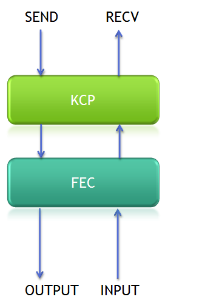
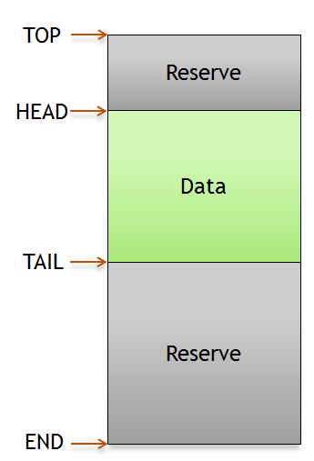

# KCP Best Practice
[출처](https://github.com/skywind3000/kcp/wiki/KCP-Best-Practice-EN )

# KCP는 FEC(순방향 오류 수정) 또는 암호화를 지원하나요?
네트워크 계층마다 다른 작업을 수행해야 한다고 생각한다. FEC의 경우 다음과 같은 많은 알고리즘이 있다:
1. 반복 : 참조로
2. XOR : P1 = M1, P2 = M2, P3 = M3, P4 = M1 ^ M2 ^ M3, P1-P4의 모든 패킷은 다른 세 가지를 함께 XOR하여 복구 할 수 있다.
3. 리드 솔로몬: 반복과 xor 보다 조금 더 복잡하지만 더 강력한다.

어느 것을 통합해야 할까요? 쉽게 결정할 수 없다. 프로토콜 계층의 기본 개념은 필요에 따라 서로 다른 계층을 함께 조합할 수 있다는 것이다.

예를 들어 KCP는 ARQ 레이어일 뿐이고, 여러분은 자신만의 FEC 레이어를 구현하여 KCP에 이렇게 연결할 수 있다:



1. KCP 출력 콜백 함수를 FEC 전송 API에 초기화한다.
2. 패킷이 FEC 레이어(fec_recv)에서 디코딩되면 ikcp_input()을 통해 KCP에 입력한다.

필자의 프로젝트에서는 리드 솔로몬 FEC 알고리즘을 직접 구현하여 아래와 같이 KCP와 협력하도록 만들었다.

또한 자신만의 암호화 계층을 만들 수도 있다.


# KCP를 기존 tcp 서버와 연동하려면 어떻게 해야 하나요?
간단하게는 TCP 서버에 KCP를 통합할 수 있다:

1. 클라이언트는 먼저 TCP 포트에 연결해야 한다.
2. 로그인에 성공하면 서버는 udp 주소:포트와 conv id를 tcp에서 클라이언트로 보낸다.
3. 클라이언트는 conv id와 udp 주소:포트를 사용하여 서버로 udp 패킷을 보낸다.
4. 서버는 conv ID를 확인하고 동일한 클라이언트라는 것을 알 수 있다.

그리고 이 연결 관리 계층 내부에서 FEC와 암호화를 구현할 수 있다.

일부 ISP 또는 회사 네트워크에서 UDP를 항상 사용할 수 있는 것은 아니므로 이러한 경우에도 여전히 tcp 연결을 사용할 수 있다.


# 서로 다른 레이어 간의 memcpy를 방지하는 방법은 무엇인가요?
암호화 계층은 일반적으로 인코딩할 때 패킷 헤더에 몇 바이트를 추가해야 하며, FEC 계층도 패킷 헤더에 몇 바이트를 추가해야 한다. memcpy를 자주 호출하지 않으려면 skbuf와 같은 데이터 구조를 도입할 수 있다:


```
void head_push_uint8(uint8_t x);
void head_push_uint16(uint16_t x);
void head_push_uint32(uint32_t x);
uint8_t head_pop_uint8();
uint16_t head_pop_uint16();
uint32_t head_pop_uint32();
...
void tail_push_uint8(uint8_t x);
...
uint32_t tail_pop_uint32();
```

이 기능을 사용하면 memcpy 없이 헤더에 바이트를 추가할 수 있다. 따라서 전체 스택에 필요한 memcpy는 단 하나뿐이다(kcp 출력 콜백 함수에서 데이터를 skbuf로 복사).


# 메모리 관리
KCP는 메모리 관리를 위해 malloc/free를 사용하며, 사용자는 다른 솔루션을 사용하려면 ikcp_allocator를 사용할 수 있다. `main()`의 첫 줄에 설정해야 한다.
```
ikcp_allocator(my_new_malloc, my_new_free);
```


# FEC의 중복성 줄이기
구체적인 전송은 애플리케이션에 따라 지정되므로 KCP를 통합한다(자세한 내용은 사용법을 참고한다).  애플리케이션 수준에서 FEC를 사용하는 경우 일부 중복 패킷이 포함될 수 있다. 즉, 수신 패킷이 p0,p1,p0,p2일 경우 중복되지 않은 패킷을 KCP(by ikcp_input)에 공급해야 하며, 중복된 p0은 KCP에 공급되지 않거나 더 많은 ACK 패킷이 있을 수 있다.

예를 들어, 애플리케이션의 FEC는 3중 중복성을 사용한다:
```
Fn = (Pn, Pn-1, Pn-2)

P0 = (0, X, X)
P1 = (1, 0, X)
P2 = (2, 1, 0)
P3 = (3, 2, 1)
```

수신기는 하나의 패킷에서 이전 두 개의 패킷을 복구할 수 있다. 사용자는 중복된 패킷을 줄인 후 KCP로 전송해야 한다.


# Advance Update
리눅스 애플리케이션 서버와 같은 서버 측 애플리케이션의 경우, 10,000개 이상의 클라이언트에 서비스를 제공하기 위해 비차단 비동기 아키텍처에서 select 또는 epoll을 사용하는 경우가 많다. 이러한 사용 시나리오의 경우 일반적으로 대량의 연결(3k 이상)을 처리해야 하므로, 각 연결에 대해 `ikcp_update`를 사용하여 업데이트할 경우 성능 문제가 발생할 수 있으므로 `ikcp_update`를 대신하여 `ikcp_check`를 사용하는 것이 좋다. `ikcp_update`가 Nms 마다 KCP를 업데이트하는 것과 달리, `ikcp_check`는 정확한 업데이트 시점을 알려준다(ikcp_send 또는 ikcp_input 호출 시에만 업데이트 필요).

예를 들어, 사용자는 처음에 `ikcp_udpate`를 사용한 후 ikcp_check를 사용하여 다음 번에 `ikcp_update`를 호출할 수 있다. `ikcp_check`를 사용하면 CPU 사용량이 60%에서 15%로 감소하는 것으로 보고 되었다.
