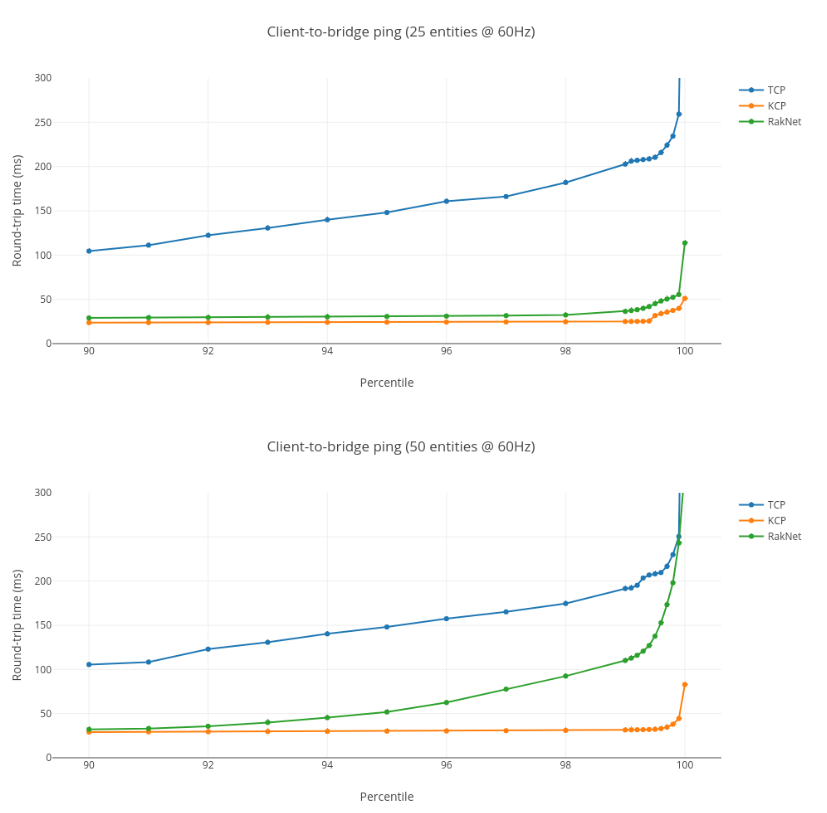

# Introducing KCP: a new low-latency, secure network stack
[출처](https://ims.improbable.io/insights/kcp-a-new-low-latency-secure-network-stack )

클라이언트 작업자가 무선 또는 모바일 네트워크를 통해 연결할 것으로 예상되는 경우, 캐릭터 게임 위치나 사격 명령 및 이벤트와 같이 시간에 민감한 업데이트에 KCP를 사용하도록 클라이언트 작업자를 구성하는 것을 강력히 고려해야 한다. 이렇게 하면 최종 사용자에게 SpatialOS 게임의 반응성을 보장하는 데 도움이 된다. SpatialOS 배포를 실행하는 데이터 센터 내의 안정적인 네트워크에서 실행되는 서버 워커의 경우 여전히 TCP가 합리적인 기본 선택이다.

## 안정적인 전송 레이어
일반적으로 SpatialOS로 빌드된 실시간 멀티플레이어 게임에서는 클라이언트-워커(플레이어의 머신)와 브리지 간에 가능한 한 빠르게 업데이트가 전달되기를 원한다. 업데이트가 지연되면 게임의 품질이 저하될 뿐만 아니라 게임 결과에 영향을 미치는 경우 플레이어가 불공정하다고 느낄 수 있다.

클라이언트-워커에서 워커 프로토콜 메시지로 전송되는 각 업데이트는 브리지까지 길고 험난한 여정을 거쳐야 한다. 패킷은 일반적으로 플레이어의 로컬 네트워크에 있는 라우터와 공용 인터넷에 있는 일련의 IP 사용 호스트를 거쳐 브리지에 도착한다. 게임 클라이언트에서 브리지까지 각 호스트 사이를 이동할 때마다 패킷이 지연되거나 완전히 삭제될 가능성이 있다.

클라이언트-워커가 할 수 있는 일은 네트워크 계층에 패킷을 전달하고 브리지로부터 패킷 수신 확인("ACK")을 받기만을 기다리는 것뿐이다. 하지만 이 확인이 오지 않으면 어떻게 될까?

바로 이때 네트워크 스택의 안정적인 전송 레이어가 작동한다. 이 계층은 패킷을 전송(전송)할 시기를 결정하는 역할을 담당한다. 패킷 전송 예약 시기는 브리지의 남은 용량(흐름 제어 창), 수신 측에서 패킷을 얼마나 빨리 승인하는지(패킷이 손실된 것으로 감지되면 재전송해야 하며, 종종 시간 초과 후) 등의 요인에 따라 달라진다. 이 스케줄링은 TCP, RakNet, KCP 각각에 대해 다르게 구현된다.

## 왜 TCP를 사용하지 않나요?
TCP의 문제점은 오래 전에 설계되었다는 것이다. TCP는 대역폭 오버헤드를 최소화하고 대규모 공유 네트워크의 혼잡을 피하기 위해 설계 되었다. 당시에는 대역폭이 부족하고 실시간 멀티플레이어 게임이 존재하지 않았기 때문에 이는 당연한 일이었다. 기존 유선 네트워크에서 패킷 손실은 보통 중간 IP 호스트의 정체를 의미했다. 따라서 패킷 손실에 대응하기 위해 TCP는 한 번에 전송할 수 있는 패킷 수를 크게 줄이고 손실된 패킷을 기하급수적으로 증가하는 간격으로 재전송한다. 따라서 인터넷과 같은 공유 네트워크가 전반적으로 원활하게 실행되지만, 가끔 지연 시간이 급증하고 처리량이 감소할 수 있다.

그러나 Wi-Fi(802.11) 및 4G와 같은 프로토콜을 사용하는 최신 무선 네트워크에서는 다른 전송 장치의 간섭과 신호 저하로 인해 전송 중에 패킷이 손상되는 경우가 많다. 일부 변형된 무선 프로토콜은 데이터 재전송을 시도하지만, 일반적으로 재시도 횟수가 제한되면 포기하고 패킷을 버리므로 결국 전송 계층에서 패킷 손실로 나타난다.

이러한 최신 네트워크의 특성과 실시간 게임 중에 데이터를 최대한 빠르게 전송하고자 하는 욕구를 결합하면 TCP와 다른 우선순위를 가진 대체 프로토콜이 필요하다는 것이 분명해진다.

## 왜 KCP를 사용해야 하나요?
대안으로 KCP와 RakNet이 있다. 두 기술 모두 각 패킷을 최대한 빨리 전송하는 것이 대역폭의 효율적인 사용과 보수적인 혼잡 회피보다 더 중요하다고 가정한다. 다른 기술 중에서도 KCP는 패킷을 더 빠르게 재전송하고, 재전송 제한 시간 전에 패킷 손실을 예상하며, 패킷 손실이 감지되면 더 느리게 백업을 수행한다.

KCP 네트워크 스택이 업데이트 지연을 완화하기 위해 사용하는 또 다른 기술은 스트림 멀티플렉싱이다. KCP는 가능한 경우 서로 다른 엔티티에 대한 업데이트를 서로 다른 독립적인 순서 스트림으로 분할한다. 이 기능은 RakNet과 TCP 네트워크 스택 모두에서 사용할 수 있지만, 각 KCP 스트림과 관련된 런타임 및 메모리 오버헤드가 적고(반면 각 TCP 스트림에는 새로운 TCP 연결이 필요함) 원하는 만큼 스트림을 가질 수 있다(RakNet은 32개로 고정됨). 따라서 작업자 연결의 멀티플렉스 수준을 선택하여 클라이언트-작업자가 시각화하거나 상호 작용할 것으로 예상되는 엔티티의 수를 처리할 수 있다.

## 이레이저 코딩 레이어
이레이저 코딩 계층은 KCP 네트워크 스택의 일부로만 사용할 수 있으며 빠르고 안정적인 전송을 더욱 향상시킨다.

그렇다면 이레이저 코딩이란 무엇일까? 안정적인 전송의 맥락에서, 이레이저 코딩은 데이터가 포함된 '원본' 패킷과 함께 전송할 추가 중복 '복구' 패킷을 생성하는 기술로, 발신자가 원본 패킷을 재전송할 필요 없이 수신자가 손실된 패킷을 재구성할 수 있도록 하는 방식이다. 가장 간단한 형태의 이레이저 코딩 중 하나는 각 패킷의 복제본을 전송하는 것으로, 복제본이 하나라도 목적지에 도달하면 데이터를 다시 전송할 필요가 없다. 트위터에서는 구성 가능한 형태의 이레이저 코딩을 최대 거리 분리 가능(MDS) 코드로 알려진 KCP 네트워크 스택에 통합했다.

## 암호화 계층
KCP 네트워크 스택이 고유한 기능을 제공하는 또 다른 계층은 암호화 계층이다. KCP 네트워크 스택의 첫 번째 버전에서는 네트워크를 통해 전송되는 모든 데이터가 DTLS를 사용하여 암호화된다. DTLS는 데이터그램 전송 계층 보안의 약자로, TLS(TCP에 해당하는)와 거의 동일한 방식으로 작동한다. 이는 공격자가 작업자가 송수신하는 데이터를 도청하는 것을 방지한다. 또한 공격자가 세션을 가로채거나 메시지를 위조하여 다른 게임 클라이언트의 세션을 방해하는 것을 방지한다.

이러한 기술은 부정 행위를 억제하고 예방하는데 어느 정도 도움이 될 수 있지만, 네트워크 계층 보안은 전투의 절반에 불과하다는 점에 유의해야 한다. 부정 행위를 가장 효과적으로 방어하려면 서버 측 권한과 같은 게임 기능 구현 옵션과 결합하여 부정 행위 감지와 같은 기능을 구현해야 한다.

현재 DTLS는 KCP에 기본적으로 활성화되어 있지만, 암호화로 인해 대역폭과 CPU 오버헤드가 추가로 발생하므로 향후에는 사용자가 선택 해제할 수 있다.

성능 분석
이제 KCP 네트워크 스택이 불안정한 네트워크에서 데이터 패킷을 빠르게 전송하는 방법을 알았으니, 이제 임프로비블에서 수행한 몇 가지 실험 결과를 살펴보고 RakNet 및 TCP와 성능을 비교해 보겠다.

각 실험은 다음과 같이 설정된다:
- "발신자" 워커는 런던에 있는 Improbable의 사무실에 있는 Linux 클라이언트 컴퓨터에서 실행된다. 이 워커는 매 틱마다 고정된 수의 엔티티에 대해 하나의 구성 요소 업데이트를 EU 클러스터에서 실행 중인 배포로 전송한다. 각 컴포넌트 업데이트에는 클라이언트 머신에 기록된 타임스탬프를 포함하여 50바이트의 데이터(하위 수준 프로토콜의 오버헤드 제외)가 포함된다. 틱 속도는 60Hz(즉, 초당 60틱)이다.
- "수신자" 워커는 동일한 클라이언트 컴퓨터에서 실행되며 브리지에서 업데이트가 도착하면 이를 읽고 "발신자" 워커에서 업데이트를 전송한 시점과 "수신자" 워커에서 수신한 시점 사이의 "왕복 시간"을 밀리초 단위로 계산한다. 기록된 각 왕복 시간은 단일 샘플이다.
- 특정 네트워크 인터페이스로 전송할 때 패킷 손실을 시뮬레이션하는 Linux 프로그램을 실행하여 각 패킷이 드랍될 확률을 0.5%로 설정한다.
- 각 실험은 한 번에 하나의 네트워크 스택을 테스트 하고 5분 동안 샘플을 수집하여 각 데이터 셋에 100,000개의 샘플을 생성한다.
- TCP와 RakNet의 경우, C# worker API에서 제공하는 기본 파라미터가 사용된다. KCP는 다음 매개변수와 목록에 없는 매개변수에 대한 기본값을 사용한다:
    - FastRetransmission: true   조기 재전송: true   비양보 흐름 제어: true  멀티플렉스 레벨: 32    업데이트 간격 밀리초: 10    MinRto밀리초: 10   EnableErasureCodec: true   ErasureCodec.OriginalPacketCount: 10     ErasureCodec.RecoveryPacketCount: 3

이 시나리오는 클라이언트가 서버 작업자와 통신하는 것이 아니라 업데이트를 보내고 받는다는 점에서 비정형적이지만, 이 시나리오를 사용하면 동일한 컴퓨터에서 타임스탬프를 계산하고 브릿지로 업데이트를 보내는 성능과 브릿지에서 업데이트를 받는 성능을 모두 동일한 결과로 통합할 수 있다는 점에 유의한다.

다음 그래프는 브리지를 통해 '발신자' 클라이언트-워크커에서 '수신자' 클라이언트-워크커로 패킷을 전송할 때의 패킷 왕복 시간(밀리초 단위)의 백분위수를 보여준다.

두 그래프 모두 불안정한 네트워크에서 최악의 대기 시간을 최소화하는 데 있어 KCP가 TCP와 RakNet 보다 우수하다는 주장을 뒷받침하는 증거를 제공한다. 특히 25개 엔터티의 경우 전체 43만 6271개의 패킷 중 가장 긴 왕복 시간은 51 밀리초인 반면, RakNet의 경우 114 밀리초였다. 평균 패킷과 비교했을 때, 이는 최악의 경우 KCP의 경우 약 30밀리초(60Hz에서 약 2프레임)의 지연이 발생한 반면, RakNet의 경우 약 90밀리초(5~6프레임)의 지연이 발생한 것에 해당한다. 이를 통해 지연이 육안으로 얼마나 눈에 띄는지 알 수 있다.

50개 엔티티의 경우 그 효과는 훨씬 더 과장되어 있다. 99.8% 백분위수는 KCP의 경우 44 밀리초인 반면 RakNet의 경우 243 밀리초이며, 최대 왕복 시간은 KCP가 83 밀리초인 반면 RakNet의 경우 327 밀리초이다. TCP는 시뮬레이션 패킷 손실이 0.5% 미만일 때 매우 열악하여 비교할 가치조차 없다.

이러한 결과는 실제 네트워크 조건과 (확률적으로) 시뮬레이션된 네트워크 조건을 조합하여 샘플링한 결과이며, 두 조건은 실험마다 다를 수 있다는 점에 유의해야 한다. 50개의 엔티티에서 초당 25~50 회의 업데이트가 발생하는 시나리오는 게임을 대략적으로 대표할 수도 있고 완전히 다를 수도 있다. 테스트 시나리오를 직접 설계하고 게임에 가장 적합한 것이 무엇인지 직접 결론을 내리는 것이 좋다.
