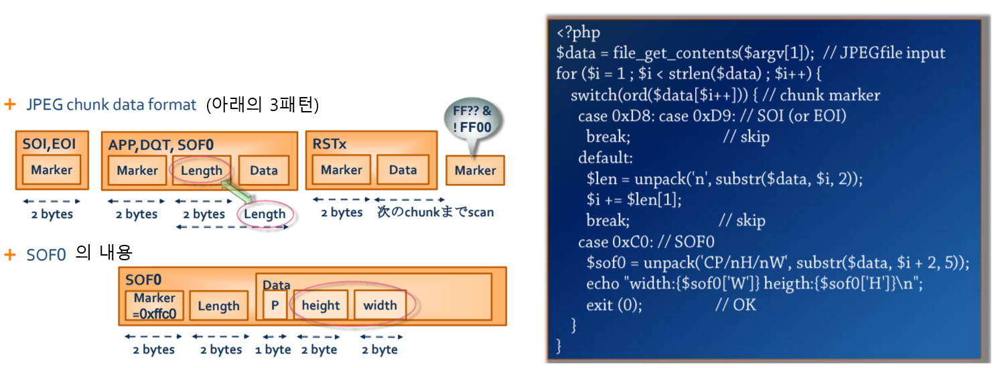
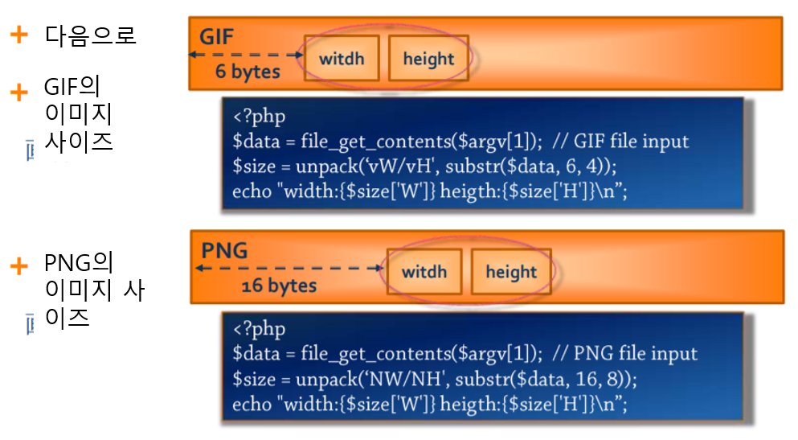
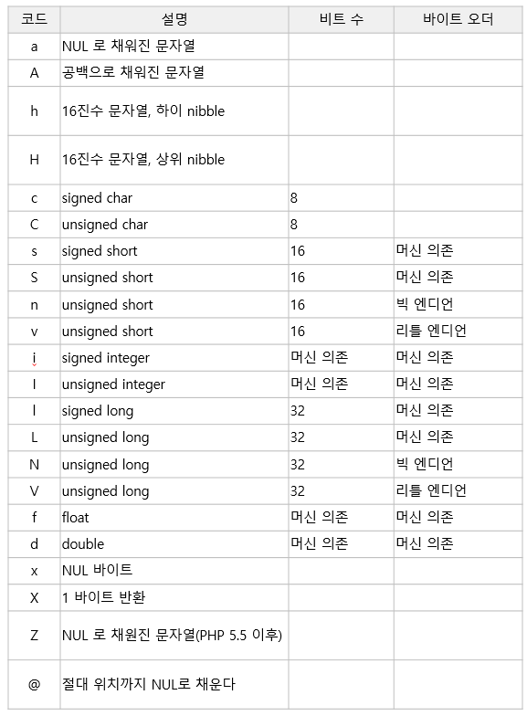

# 바이너리 데이터 다루기
[이 문서](https://www.slideshare.net/yoyayoya1/php-10133775 )를 정리  
  
PHP에서는 String 타입으로 바이너리 데이터를 다룰 수 있다.  
PHP는 String 타입에 대해서 문자로서 특별한 것을 하지 않는다.  
PHP에서 문자열 타입은 바이트 배열과 정수 값(버퍼 길이)로 구현되어 있다. 바이트 열을 문자열로 변환하는 방법에 대해서는 어떤 정보도 가지고 있지 않고, 완전하게 프로그래머에게 맡긴다. 
바이너리 데이터 조작은 `str` 계열의 함수를 사용한다.  
    
    
## 바이너리와 정수 값 상호 변환
바이너리 -> 정수 값 (빅엔디언)   
```
// 2바이트
$b = unpack('n', $a)

// 4바이트
$b = unpack('N', $a)
```
  
바이너리 -> 정수 값 (리틀엔디언)   
```
// 2바이트
$b = unpack('v', $a)

// 4바이트
$b = unpack('V', $a)
```
  
pack은 `unsigned`로 처리한다.  
  

## 사용 예 
    
  
      
  

### GIF 파일 데이터 변환 예
파일의 선두에서  
```
47 49 46 38 39 61 78 00 5A 00
```
와 같은 데이터다 저장되어 있다면  
```
$fp = fopen( 'sample.gif', 'rb' );
$data = fread( $fp, 10 );

$format = 'a3signature/a3version/vwidth/vheight';
$info = unpack( $format, $data );
```
  
이렇게 하면 unpack()이 반환하는 배열에는 아래와 같은 데이터가 저장되어 있다  
```
Array
(
    [signature] => GIF  // 47 49 46
    [version] => 89a    // 38 39 61
    [width] => 120      // 78 00 (0x0078 = 120)
    [height] => 90      // 5A 00 (0x005A = 90)
)
```
  
  

## 포맷 문자열
      
  

## 참고 글
- [How to work with binary data in PHP](https://blog-en.openalfa.com/how-to-work-with-binary-data-in-php )
- [PHP pack API](https://www.php.net/manual/ja/function.pack.php )
- [PHP unpack API](https://www.php.net/manual/ja/function.unpack.php )  
- [mdurrant/php-binary-reader](https://github.com/mdurrant/php-binary-reader )  