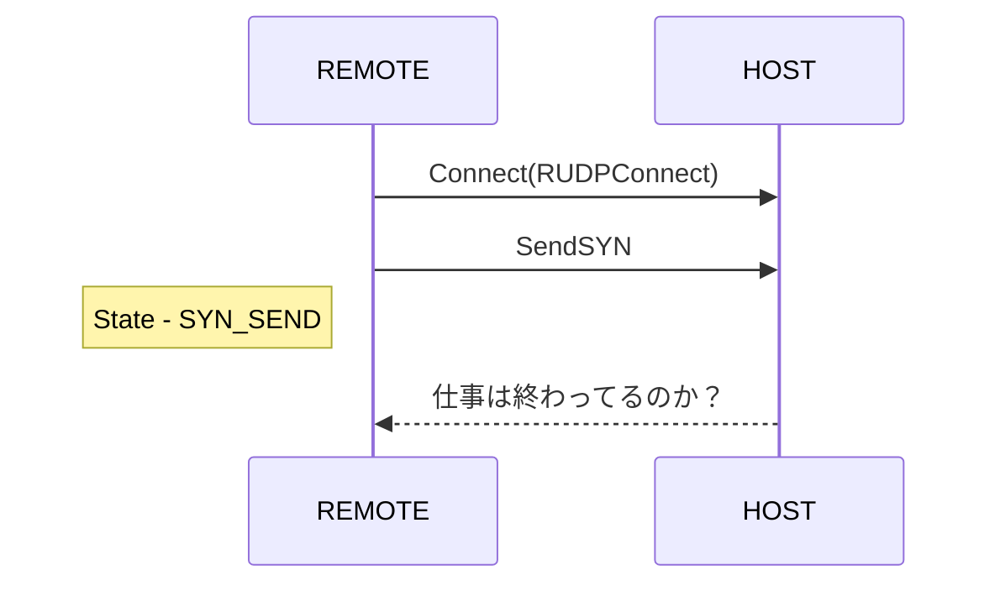
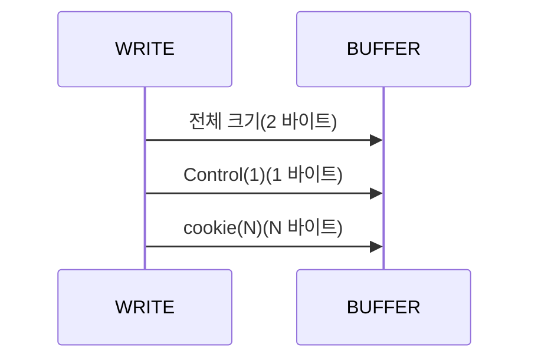
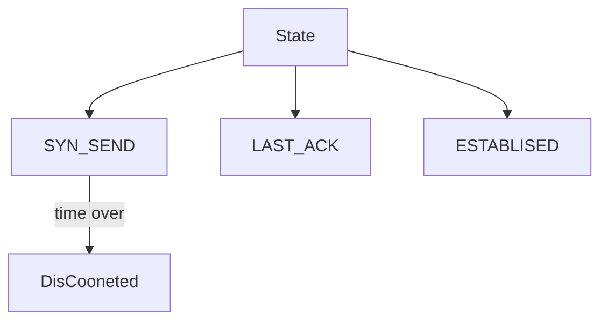

# C# RUDP 
  
## 시퀸스 다이얼그램  

```mermaid
sequenceDiagram
    REMOTE->>HOST: Connect(RUDPConnect)
    REMOTE->>HOST: SendSYN 
    Note left of REMOTE: State - SYN_SEND
    %% this is a comment
    HOST-->>REMOTE: 仕事は終わってるのか？
```  
  

### Send SYN  

```mermaid
sequenceDiagram
    WRITE ->> BUFFER: 전체 크기(2 바이트)
    WRITE ->> BUFFER: Control(1)(1 바이트)
    WRITE ->> BUFFER: cookie(N)(N 바이트)
```  
  

### Process Send

```mermaid
graph TD;
    State --> SYN_SEND
    SYN_SEND --> |time over| DisCooneted
    State --> LAST_ACK
    State --> ESTABLISED
```  
  

### Process Receive
