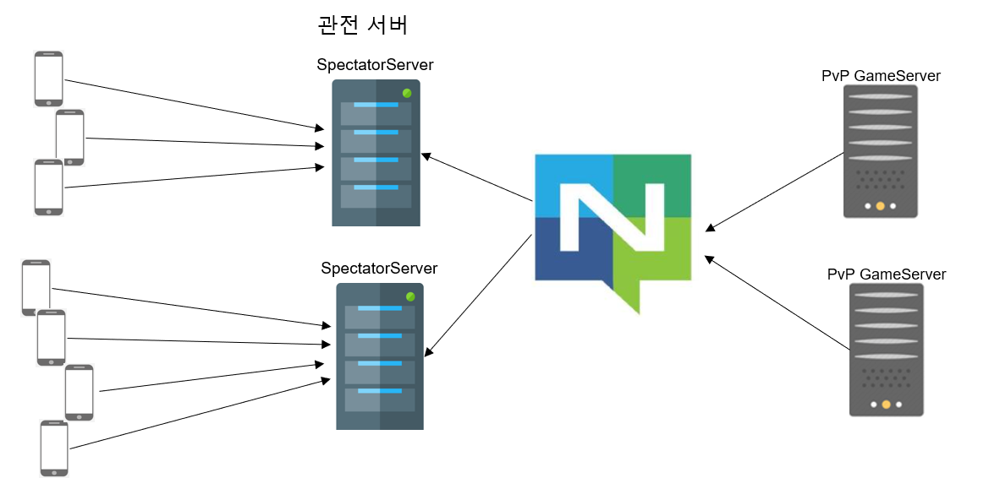
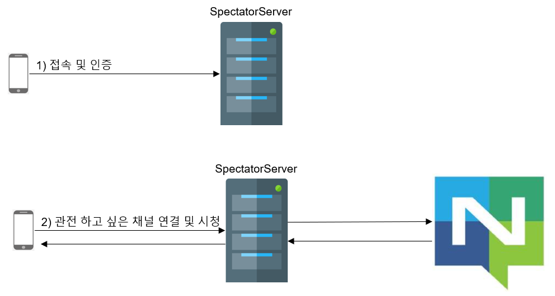
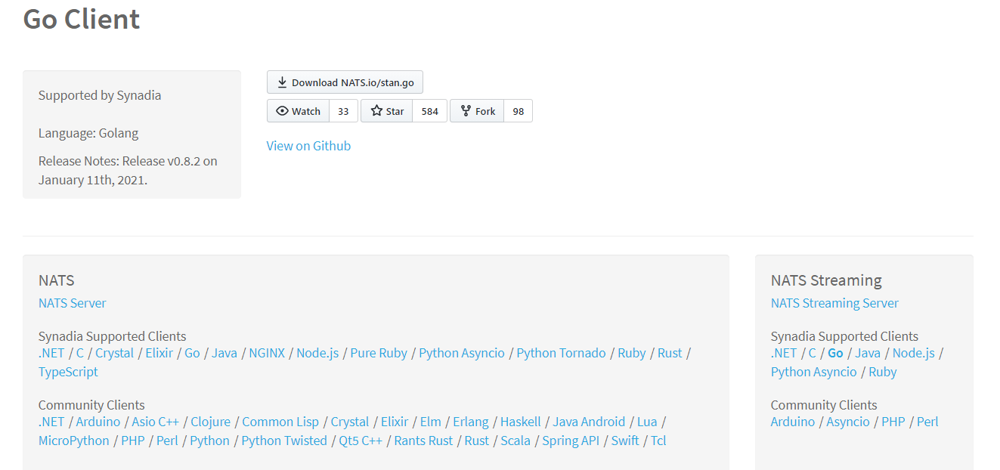

# NATS MQ를 이용한 게임 관전 시스템

## 개요
- 게임 리플레이 데이터 저장 및 전송을 위해 [NATS MQ](https://nats.io/ )를 사용한다.
- [The NATS Streaming server 공식 문서](https://docs.nats.io/nats-streaming-concepts/intro )
- Publisher/Subscriber Rate Limit NATS 스트리밍을 구현하는 서버가 NATS 스트리밍 서버로 NATS 서버를 베이스로 구현되어 있다. 내부에서는 Protocol Buffers도 사용하고 있다.
- 실행 방법
    - NATS Streaming Server로 단독 실행
	- Golang의 경우 Streaming 기능을 라이브러리로 사용할 수 있다.
- At-least-once	
    - 클라이언트에 최소 1회는 메시지를 보낼 수 있다.
	- 클라이언트에서 ACK를 너무 늦게 보내면 자동으로 재전송 한다.
   
- 관전 시퀸스
   
  
- 실 시간 관전, 경기가 끝난 게임 관전이 가능하다
- 관전 데이터를 NATS MQ를 통해 메모리 저장, 파일 저장, SQL 저장을 한다(default는 메모리)
- 이어 보기 가능. 순번 or 시간 단위로
- 클러스터 지원
          
   
## NATS Streaming 실행
[여기](https://github.com/nats-io/nats-streaming-server/releases )에서 실행 파일을 다운로드 한다.  
실행 파일 이름은 **nats-streaming-server** 이다.  

클라이언트는 아래처럼 실행한다.  
<PRE>
$ git clone https://github.com/nats-io/go-nats-streaming.git
$ cd go-nats-streaming/examples
$ go build stan-pub.go
$ go build stan-sub.go
</PRE>
  
서버 실행  
<PRE>
$ ./nats-streaming-server -m 8222
[87442] 2016/07/15 20:14:50.605166 [INF] Starting nats-streaming-server[test-cluster] version 0.2.0
[87442] 2016/07/15 20:14:50.605457 [INF] Starting nats-server version 0.9.0.beta
[87442] 2016/07/15 20:14:50.605467 [INF] Listening for client connections on localhost:4222
[87442] 2016/07/15 20:14:50.607194 [INF] Server is ready
[87442] 2016/07/15 20:14:50.944737 [INF] STAN: Message store is MEMORY
[87442] 2016/07/15 20:14:50.944755 [INF] STAN: Maximum of 1000000 will be stored
</PRE>
  
nats-top을 확인하면 스트리밍 서버가 실행하는 시점에서 내부에서 클라스터용 클라이언트가 있다.  
gnatsd 상에서 돈다는 것이 여기서 알 수 있다.   
  
<PRE>  
NATS server version 0.9.0.beta (uptime: 4m49s)
Server:
  Load: CPU:  0.0%  Memory: 11.0M  Slow Consumers: 0
  In:   Msgs: 1  Bytes: 45  Msgs/Sec: 0.0  Bytes/Sec: 0
  Out:  Msgs: 0  Bytes: 0  Msgs/Sec: 0.0  Bytes/Sec: 0

Connections Polled: 1
  HOST                 CID      NAME            SUBS    PENDING     MSGS_TO     MSGS_FROM   BYTES_TO    BYTES_FROM  LANG     VERSION  UPTIME   LAST ACTIVITY
  127.0.0.1:65386      2        NATS-Streaming-Server-test-cluster 5       0           0           1           0           45          go       1.2.2    4m49s    2016-07-15 20:15:48.18
</PRE>
    
## Streaming Pub/Sub
Sub 클라이언트가 없는 상태에서 Pub 클라이언트에서 메시지를 보내 본다.  
<PRE>
$ ./stan-pub subject.hoge "Hello NATS Streaming"
Published [subject.hoge] : 'Hello NATS Streaming'
$ ./stan-pub subject.hoge "Hello NATS Streaming 2"
Published [subject.hoge] : 'Hello NATS Streaming 2'
</PRE>
  
여기에서 Sub 클라이언트를 실행한다.  
`--all` 옵션을 붙여서 모든 유효한 메시지를 받도록 한다.  
<PRE>  
$ ./stan-sub -id STANSUB1 --all subject.hoge
Connected to nats://localhost:4222 clusterID: [test-cluster] clientID: [STANSUB1]
subscribing with DeliverAllAvailable
Listening on [subject.hoge], clientID=[STANSUB1], qgroup=[] durable=[]
[#1] Received on [subject.hoge]: 'sequence:1 subject:"subject.hoge" data:"Hello NATS Streaming" timestamp:1468581922036801904 '
[#2] Received on [subject.hoge]: 'sequence:2 subject:"subject.hoge" data:"Hello NATS Streaming 2" timestamp:1468581932488709393 '
</PRE>  
  
NATS의 Pub/Sub 에서는 퍼블리쉬한 시점에서 서브스크라이버 하지 않으면 메시지를 수신 할 수 없었지만 NATS Streaming에서는 수신할 수 있다.  
  
`--last` 옵션을 붙여서 최후의 메시지만을 받을 수도 있다.  
stan-sub.go의 옵션을 보면 메시지의 기한 설정으로 유효하지 않으면 수신하지 않도록 하는 것도 가능한 것 같다.  
  

## 메시지 저장
nats-streaming-server는 default로는 인메모리로 메시지 저장 하고 있지만 `-store FILE -dir ${DIRNAME}`을 지정하면 DIRNAME 디렉토리를 만들고 그 아래에 파일로 메시지를 저장 할 수 있다.  
  
<PRE>  
$ ./nats-streaming-server -m 8222 -store FILE -dir streaminglogs
            :
[91285] 2016/07/15 20:45:08.489025 [INF] STAN: Message store is FILE
            :
</PRE>
  			
<PRE>
$ ls -ltr streaminglogs/*
-rw-r--r--  1 hattori-h  staff  195  7 15 20:43 streaminglogs/server.dat
-rw-r--r--  1 hattori-h  staff   71  7 15 20:45 streaminglogs/clients.dat

streaminglogs/subject.hoge:
total 48
-rw-r--r--  1 hattori-h  staff   4  7 15 20:45 subs.dat
-rw-r--r--  1 hattori-h  staff   4  7 15 20:45 msgs.5.dat
-rw-r--r--  1 hattori-h  staff   4  7 15 20:45 msgs.4.dat
-rw-r--r--  1 hattori-h  staff   4  7 15 20:45 msgs.3.dat
-rw-r--r--  1 hattori-h  staff   4  7 15 20:45 msgs.2.dat
-rw-r--r--  1 hattori-h  staff  62  7 15 20:45 msgs.1.dat
</PRE>
      
  
  
## configuring
    
### Command Line Arguments
[문서](https://docs.nats.io/nats-streaming-server/configuring/cmdline )    
- 클러스터 이름: `-cid <string>`
   
### Configuration File
[문서](https://docs.nats.io/nats-streaming-server/configuring/cfgfile )   
   
### Store Limits
[문서](https://docs.nats.io/nats-streaming-server/configuring/storelimits )   
설정 파일에서는 `store_limits` 항목, Command Line Arguments에서는 `-mc`, `-mm` 부분이다.  
  
<br>  

## Clustering
   
### 지원되는 저장소
NATS Streaming Server를 클러스터 모드로 실행하려면 영구 저장소를 지정해야한다. 현재 FILE 및 SQL을 선택할 수 있다.  
  
NATS 스트리밍 서버는 옵션을 사용하여 구성한 스토리지에 서버 메타 정보와 메시지를 저장한다.
옵션 `--store`을 사용한다.  
  
그러나 클러스터 모드에서는 리더 선택에 RAFT를 사용한다. raft 레이어는 현재 반드시 파일 기반인 자체 저장소를 사용한다. RAFT 저장소의 위치는 기본적으로 클러스터 ID의 이름을 따서 명명된 하위 디렉터리 아래의 현재 디렉터리로 설정되거나 옵션 `--cluster_log_path`을 사용하여 구성 할 수 있다.  

### SQL 저장소를 사용하는 경우 중요:
- 여전히 RAFT 데이터를 파일 시스템에 저장해야한다.
- 클러스터의 각 노드에는 자체 "데이터베이스"가 있어야 한다. 즉, 두 노드가 동일한 테이블을 공유해서는 안된다.    
    

### 참고
- [High availability with nats-streaming-server (clustering)](https://carlosbecker.com/posts/nats-streaming-server-cluster/ )

  
<br>  
  
## 스트리밍 클라이언트 프로그래밍. Golang
- 다양한 언어를 지원하고 있다. 이 글에서는 Golang을 대상으로 한다.
- [Golang 버전 라이브러리](https://github.com/nats-io/stan.go/)    
- NATS 서버와 클라이언트가 다르다. 아래 그림의 오른쪽에 Straming 클라이언트 라이브러리가 있다.  
   
- NATS 클라이언트는 스트리밍 서버와 직접 연결이 아니다. 그래서 클라이언트에서 명시적으로 Close() 함수를 호출하지 않으면 연결이 끊어짐을 즉시 알아차리지 못한다. 스트리밍 서버는 클라이언트의 끊어짐을 감지하기 위해 하트비트를 사용하고 있어서, 클라이언트가 CLose()를 호출하지 않으면 서버와 끊어짐에 시간 차가 발생할 수 있다.  
    - 클라이언트 라이브러리는 일정 간격으로 PING을 보내고(default는 5 초), 일정 수의 PING이 어떤 응답도 없다면(default는 3), 스트리밍 접속을 닫는다.   
	- 이 경우 콜백(등록 되어 있다면)이 호출 되어 접속이 문제가 있음과 이유를 유저에게 통지한다.
  

### 연결  
- 연결 할 때 클러스터 이름이 필요하다. 스트리밍 서버를 실행하면 default로 클러스트 이름 "test-cluster" 이므로 서버 실행 시에 따로 이름을 부여하지 않았다면 연결할 때 "test-cluster"를 클러스터ID로 사용해야 한다.  
   
  
연결 예제 코드 1)  
```
sc, err := stan.Connect(clusterID, clientID)
```
  

연결 예제 코드 2)        
```
sc, err := stan.Connect(clusterID, clientID, stan.NatsURL("nats://localhost:1234"))
```
   

연결 예제 코드 3)         
```
sc, err := stan.Connect(clusterID, clientID, stan.NatsConn(nc))
```
  
  
연결 예제 코드 4)  
```
// Connect Options.
opts := []nats.Option{nats.Name("NATS Streaming Example Subscriber")}
// Use UserCredentials
if userCreds != "" {
  opts = append(opts, nats.UserCredentials(userCreds))
}

// Connect to NATS
nc, err := nats.Connect(URL, opts...)
if err != nil {
  log.Fatal(err)
}
defer nc.Close()

sc, err := stan.Connect(clusterID, clientID, stan.NatsConn(nc),
  stan.SetConnectionLostHandler(func(_ stan.Conn, reason error) {
    log.Fatalf("Connection lost, reason: %v", reason)
  }))
if err != nil {
  log.Fatalf("Can't connect: %v.\nMake sure a NATS Streaming Server is running at: %s", err, URL)
}
```    
  
연결 옵션 구조체:  
```
// Options can be used to a create a customized connection.
type Options struct {
	// NatsURL is an URL (or comma separated list of URLs) to a node or nodes
	// in the cluster.
	NatsURL string

	// NatsConn is a user provided low-level NATS connection that the streaming
	// connection will use to communicate with the cluster. When set, closing
	// the NATS streaming connection does NOT close this NATS connection.
	// It is the responsibility of the application to manage the lifetime of
	// the supplied NATS connection.
	NatsConn *nats.Conn

	// ConnectTimeout is the timeout for the initial Connect(). This value is also
	// used for some of the internal request/replies with the cluster.
	ConnectTimeout time.Duration

	// AckTimeout is how long to wait when a message is published for an ACK from
	// the cluster. If the library does not receive an ACK after this timeout,
	// the Publish() call (or the AckHandler) will return ErrTimeout.
	AckTimeout time.Duration

	// DiscoverPrefix is the prefix connect requests are sent to for this cluster.
	// The default is "_STAN.discover".
	DiscoverPrefix string

	// MaxPubAcksInflight specifies how many messages can be published without
	// getting ACKs back from the cluster before the Publish() or PublishAsync()
	// calls block.
	MaxPubAcksInflight int
	
	// PingInterval is the interval at which client sends PINGs to the server
	// to detect the loss of a connection.
	PingInterval int

	// PingMaxOut specifies the maximum number of PINGs without a corresponding
	// PONG before declaring the connection permanently lost.
	PingMaxOut int

	// ConnectionLostCB specifies the handler to be invoked when the connection
	// is permanently lost.
	ConnectionLostCB ConnectionLostHandler
}
```  
  

### Subscriber 시작  
`StartAt`, `StartAtSequence`, `StartAtTime`, `StartAtTimeDelta`,  `StartWithLastReceived`  
- StartAt: 상수로 시작 위치를 지정해서 시작한다.  
```
const (
	StartPosition_NewOnly        StartPosition = 0
	StartPosition_LastReceived   StartPosition = 1
	StartPosition_TimeDeltaStart StartPosition = 2
	StartPosition_SequenceStart  StartPosition = 3
	StartPosition_First          StartPosition = 4
)
```  
- StartAtSequence: 일련 번호를 지정하여 이 위치부터 시작한다.
- StartAtTime: 시작 시간으로 지정하여 시작한다.
- StartAtTimeDelta: 시작 시간을 기준으로 지정된 시간이 지난 후부터
- StartWithLastReceived: 이전에 마지막으로 받은 것 다음부터 시작한다.
 
  
### 받기
받는 형식은 아래와 같다.   
Regular, Durable, Queue, Queue/Durable  

```
sub, err := sc.Subscribe("foo",
  func(m *stan.Msg) {...},
  stan.StartWithLastReceived())
``` 
  

### 보내기  
  
```
err := sc.Publish("foo", []byte("Hello World"))
```  
  
```
ackHandler := func(ackedNuid string, err error){ ... }

nuid, err := sc.PublishAsync("foo", []byte("Hello World"), ackHandler)
```    
  
  
## 스트리밍 클라이언트 프로그래밍. C#
- [GitHub](https://github.com/nats-io/stan.net )    
- [NuGet](https://www.nuget.org/packages/STAN.Client )
 
### 연결
- 기본 연결 주소(로컬)로 연결하는 경우
```
var cf = new StanConnectionFactory();
using (var c = cf.CreateConnection("test-cluster", "appname"))
{
}
```   
    
- 지정된 주소로 연결하기    
```
var cOpts = StanOptions.GetDefaultOptions();
cOpts.NatsURL = $"nats://{IP}:{Port}";

IStanConnection MQClient = new StanConnectionFactory().CreateConnection(textBoxClusterID.Text, textBoxClientID.Text, cOpts);
```
  
  
### 스트리밍 시작
- 가장 마지막 것 받기
```
var opts = StanSubscriptionOptions.GetDefaultOptions();
opts.StartWithLastReceived();
var s = c.Subscribe("foo", opts, (obj, args) =>
{
    Console.WriteLine("Received a message: {0}",
        System.Text.Encoding.UTF8.GetString(args.Message.Data));
});
```
  
- 모든 것 다 받기
```
// Receive all stored values in order
var opts = StanSubscriptionOptions.GetDefaultOptions();
opts.DeliverAllAvailable();
var s = c.Subscribe("foo", opts, (obj, args) =>
{
    Console.WriteLine("Received a message: {0}",
        System.Text.Encoding.UTF8.GetString(args.Message.Data));
});
```
  
- 지정 순번부터 받기
```
// Receive messages starting at a specific sequence number
var opts = StanSubscriptionOptions.GetDefaultOptions();
opts.StartAt(22);
var s = c.Subscribe("foo", opts, (obj, args) =>
{
    Console.WriteLine("Received a message: {0}",
        System.Text.Encoding.UTF8.GetString(args.Message.Data));
});
```
  
- 절대 시간 기준으로 시작
```  
// Subscribe starting at a specific time
var opts = StanSubscriptionOptions.GetDefaultOptions();
opts.StartAt(new DateTime(2016, 07, 28, 5, 35, 04, 570));
var s = c.Subscribe("foo", opts, (obj, args) =>
{
    Console.WriteLine("Received a message: {0}",
        System.Text.Encoding.UTF8.GetString(args.Message.Data));
});
```
   
- 상대 시간 기준으로 시작
```   
// Subscribe starting a specific amount of time in the past (e.g. 30 seconds ago)
var opts = StanSubscriptionOptions.GetDefaultOptions();
opts.StartAt(new TimeSpan(0, 0, 30));
var s = c.Subscribe("foo", opts, (obj, args) =>
{
    Console.WriteLine("Received a message: {0}",
        System.Text.Encoding.UTF8.GetString(args.Message.Data));
});
```
  
  
### 이어서 보기
앞에 접속이 끊어진 이후부터 스트리밍 하기   
```
var cf = new StanConnectionFactory();
var c = cf.CreateConnection("test-cluster", "client-123");

// Subscribe with a durable name
var opts = StanSubscriptionOptions.GetDefaultOptions();
opts.DurableName = "my-durable";

var s = c.Subscribe("foo",  opts, (obj, args) =>
{
    Console.WriteLine("Received a message: {0}",
        System.Text.Encoding.UTF8.GetString(args.Message.Data));
});
...
// client receives message sequence 1-40
...
// client disconnects for an hour
...
// client reconnects with same clientID "client-123"
c = cf.CreateConnection("test-cluster", "client-123");

// client re-subscribes to "foo" with same durable name "my-durable" (set above)
var s = c.Subscribe("foo",  opts, (obj, args) =>
{
    Console.WriteLine("Received a message: {0}",
        System.Text.Encoding.UTF8.GetString(args.Message.Data));
});
...
// client receives messages 41-current
```
    

### PING 설정
  
```
StanOptions so = StanOptions.GetDefaultOptions();
so.PingInterval = 10000;
so.PingMaxOutstanding = 5;
so.ConnectionLostEventHandler = (obj, args) =>
{
	// handle the case where a connection has been lost
}

var sc = new StanConnectionFactory().CreateConnection(CLUSTER_ID, CLIENT_ID, so);
```
  
  
### 중복 접속
클라이언트가 서버로부터 "절단" 되어 있는 사이에 스트리밍 서버에 다른 클라이언트가 접속하여 같은 클라이언트 ID를 사용한다면 서버는 클라이언트 ID 중복을 검출하고 첫번째 클라이언트에 연락해서 두 번째 클라이언트의 접속 요구를 거부할지 어떨지 통보한다.  
서버와 첫 번째 클라이언트 간의 통시닝 절단 되어 있으므로 서버는 응답을 받지 못해서 첫 번째 클라이언트를 두 번째 클라이언트로 교체한다.
  
  
### Asynchronous Publishing
기본 publish API(Publish(subject, payload))는 동기로 동작하므로 NATS Streaming 서버가 메시지 수신을 확인할 때까지 호출처러 제어를 반환하지 않는다.   
보다 더 고성능을 내기 위해서 비동기 publish api를 사용해야 한다.  
  
닷넷 버전의 클라이언트는 비동기를 위해 asyncawait 사용을 지원한다.  
await upon에 반환된 태스크는  발행된 메시지의 GUID가 포함 되어 있다. Publish API는 애플리케이션 흐름 제어를 가능하게 하기 위해 최대 미 처리응답 수에 도달한 경우 블럭한다  
```
// all in one call.
var guid = await c.PublishAsync("foo", null);

// alternatively, one can work in some application code.
var t = c.PublishAsync("foo", null);

// your application can do work here

guid = await t;
```
    
```
var cf = new StanConnectionFactory();
var c = cf.CreateConnection("test-cluster", "client-123");

// when the server responds with an acknowledgement, this
// handler will be invoked.
EventHandler<StanAckHandlerArgs> ackHandler = (obj, args) =>
{
    if (!string.IsNullOrEmpty(args.Error))
    {
        Console.WriteLine("Published Msg {0} failed: {1}",
            args.GUID, args.Error);
    }

    // handle success - correlate the send with the guid..
    Console.WriteLine("Published msg {0} was stored on the server.");
};

// returns immediately
string guid = c.Publish("foo", null, ackHandler);
Console.WriteLine("Published msg {0} was stored on the server.", guid);
```  
  
  
### Message Acknowledgements and Redelivery
NATS Streaming은 At-Least-Once 배달 세만틱스를 제공한다.  
즉 대상이 되는 가입자에게 메시지기가 배달된 후, 설정된 타임 아웃 시간내에 확인 응답이 수신되지 않는 경을NATS Streaming은 메시지 재 전송을 해본다. 이 타임 아웃 간격은 서브 스크립션의 AckWait에 지정 되어 있다.  
    
```
var sOpts = StanSubscriptionOptions.GetDefaultOptions();
sOpts.ManualAcks = true;
sOpts.AckWait = 60000;
var s = c.Subscribe("foo", sOpts, (obj, args) =>
{
    // ack message before performing I/O intensive operation
    args.Message.Ack();

    // Perform long operation.  Note, the message will not be redelivered
    // in an application crash, unless requested.
});
```
  

### Rate limiting/matching
퍼블리쉬, 서브스크라이브, 메시징의 전형적인 문제는 메시지 작성자의 속도와 메시지 수신자의 속도를 일치 시키는 것이다.  
메시지 작성자는 메시지를 소비하는 구독자의 스피드를 향상 시킬 수 있다.  이 미스매치는 일반적으로 "빠른 프로듀서와 느린 컨슈머" 문제라고 불리고, 느린 컨슈마가 쫗아 올 때까지를 버퍼링 하기 위해서 기초가 되는 메시징 시스템의 리소스 활용률과 극적으로 올린다.


#### Publisher rate limiting
NATS Streaming은 MaxPubAcksInflight 라고 불리는 접속 옵션을 제공하고 있다. 이것은 퍼블리쉬가 임의의 시간에 기내에 유지 중인 미 확인 메시지 수를 효과적으로 제한한다. 이 최대 값에 도달하면 PublishAsync() 호출은 미 통지 메시지 수가 지정된 제한을 내여갈 때까지 블럭된다.   
  
```
var cf = new StanConnectionFactory();

var opts = StanOptions.GetDefaultOptions();
opts.MaxPubAcksInFlight = 25;

var c = cf.CreateConnection("test-cluster", "client-123", opts);

EventHandler<StanAckHandlerArgs> ackHandler = (obj, args) =>
{
    // process the ack.
};

for (int i = 0; i < 1000; i++)
{
    // If the server is unable to keep up with the publisher, the number of oustanding acks will eventually
    // reach the max and this call will block
    string guid = c.Publish("foo", null, ackHandler);
}
```
  
#### Subscriber rate limiting
레이트 제한은 MaxInflight 라고 불리는 서브스크립션을 사용하여 서브스크라이버 간에 서브스크립션 할 수 있다. 이 옵션은 NATS Streaming이 특정 서브스크립션에 대해서 허가하는 미 처리 확인 응답(배신 되었지만 확인 응답이 없는 메시지) 최대 수를 지정한다. 이 값을 넘으면 NATS Streaming은 미 확인 메시지 수가 지정된 상한 보다 작아질 때까지 이 서브 스크립션으로의 메시지 배달을 정지 시킨다.  
```
var sOpts = StanSubscriptionOptions.GetDefaultOptions();
sOpts.ManualAcks = true;
sOpts.MaxInflight = 25;
var s = c.Subscribe("foo", sOpts, (obj, args) =>
{
    Console.WriteLine("Received a message: {0}",
        System.Text.Encoding.UTF8.GetString(args.Message.Data));
   ...
   // Does not ack, or takes a very long time to ack
   ...
   // Message delivery will suspend when the number of unacknowledged messages reaches 25
});
```
  
  
#### 기능 테스트
- Pub 후 Sub 해보기
    - StartAtSequence 로 Sub 하면 시작 위치에서 현재까지 한번에 짝 다 받는다.
    - Sub의 콜백함수는 스레드 1개가 할당 되어 있음. 콜백함수내에 sleep 있으면 중단 된다
- Pub 후 Sub 해보기, 시청 종료, Sub 해보기. NATS MQ에 데이터가 아직 남아 있나 
    - Sub 잘 됨
- Pub 후 Sub 해보기, 프로그램 종료, Sub 해보기. NATS MQ에 데이터가 아직 남아 있나
    - Sub 잘 됨
- Pub 후 프로그램 종료, Sub 해보기.  NATS MQ에 데이터가 아직 남아 있나
    - 데이터가 남아 있음. Sub 가능
- Sub를 간격을 조절할 수 있나?
    - 불가능. MaxInflight 라는 항목이 있으나 이것은 Sub쪽에서 Ack 응답을 하지 않아도 보낼 수 있는 수로 간격 조절용으로 사용하기에는 미료함
   
<br>  
<br>  

## Web API 서버를 관전 서버로
- 클라이언트에서 관전을 원한다면 폴링으로 요청하도록 한다    
   

<br>  
<br>  

## 실 시간 서버를 관전 서버로    